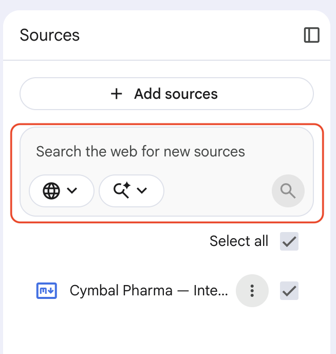
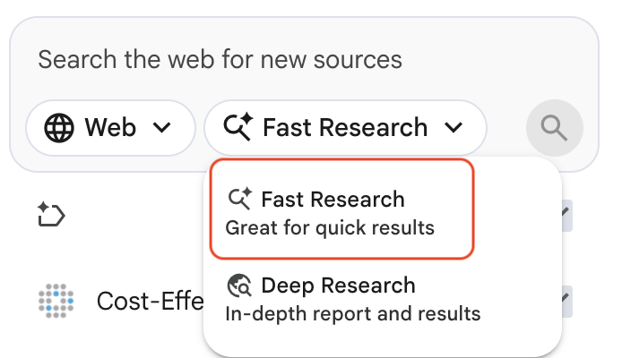
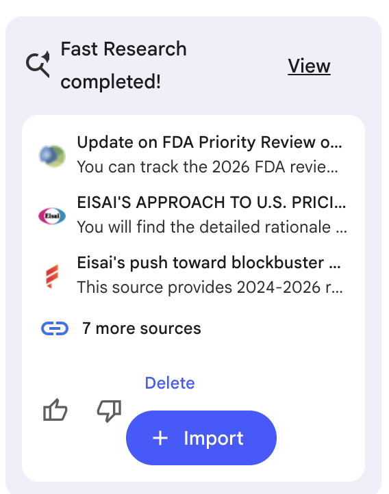
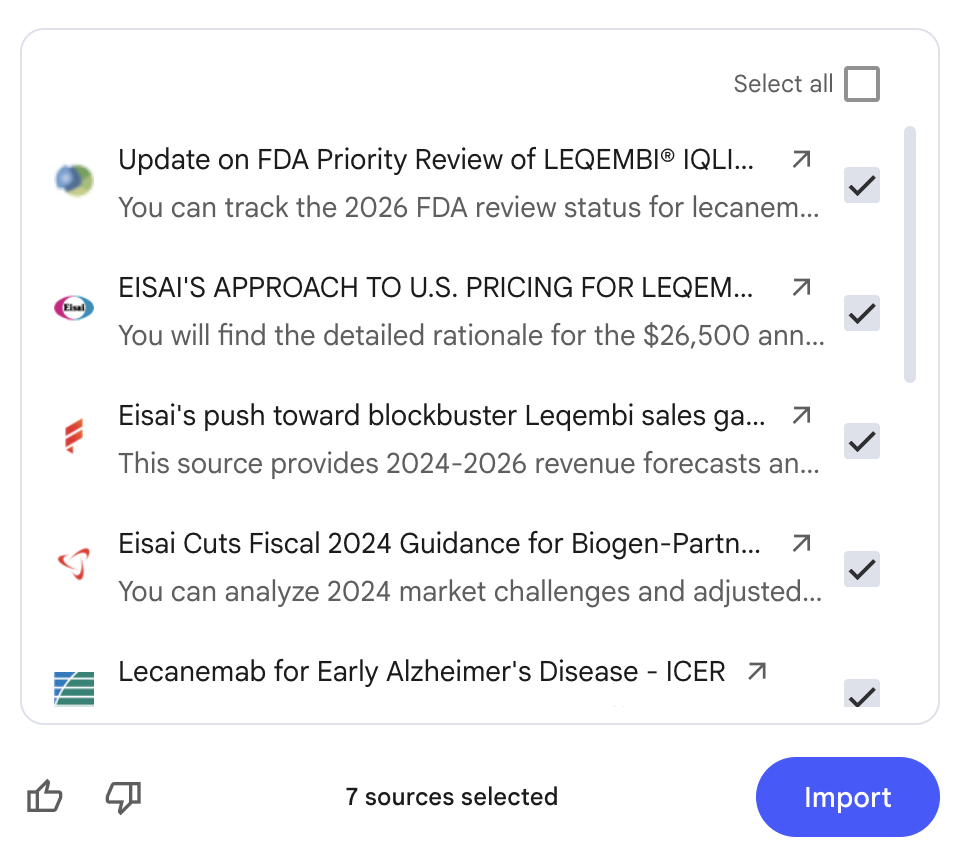

# Search the Web for Sources

## Time Required
30 minutes

## Overview
In this lab, you will use NotebookLM's built-in web search feature to find and add live sources from the internet directly into your notebook—no copy-pasting from a browser required. This turns NotebookLM into a competitive intelligence workspace where your private internal data and real-world external research sit side by side, and every answer cites exactly where it came from.

### You learn how to:
- Add internal data to a notebook as copied text.
- Use the Notebook LM web search to find and add live sources.
- Choose between Fast Research and Deep Research modes.
- Ask analytical questions that combine private internal data with public external sources.

## Scenario

<p align="left">
  
</p>

You are the Director of Business Development and Investor Relations at Cymbal Pharma. The company is preparing a **Series B funding pitch** to raise $45 million for CPH-412's upcoming Phase 1b trial.

To convince investors, you need to prove that Cymbal's market positioning is strong—and that the opportunity in Alzheimer's disease is real and large. You have Cymbal's internal pipeline and financial data, but also need real-world competitor intelligence: recent FDA approvals, drug pricing, pipeline updates, and market size forecasts for the Alzheimer's space.

In this lab, you will load Cymbal's internal data into a notebook and then use NotebookLM's web search to pull in live competitor intelligence—building a research workspace that can answer the hard investor questions.

## Lab Instructions

### Task 1: Create the Notebook and add Cymbal's internal data

1. Open [NotebookLM](https://notebooklm.google.com/) and click **Create new notebook**. Close the __Add sources__ screen, and then name the notebook `CPH-412 Series B Pitch Research`.

   <p align="left">
     
     <br><em>The CPH-412 Series B Pitch Research notebook</em>
   </p>

2. In the **Sources** panel, click **+ Add sources**, select **Copied text**, and then paste the following, and click **Insert**:

   ```text
   CYMBAL PHARMA—INTERNAL PIPELINE & FINANCIAL BRIEF
   Prepared for: Series B Investor Briefing | Confidential

   PIPELINE

   CPH-412 (Lead Compound)
   - Indication: Alzheimer's disease (amyloid plaque reduction and neuroprotection)
   - Mechanism: Dual-action compound — CYP3A4 modulation with downstream ROS stress reduction
   - Current Stage: Phase 1b ready. Phase 1a completed; dose optimization in progress following high-dose safety signals.
   - Estimated Phase 1b Cost: $18M
   - Projected IND filing for Phase 2: Q3 next year

   CPH-287 (Secondary Compound)
   - Indication: Parkinson's disease (early-stage neurodegeneration)
   - Current Stage: Preclinical. Estimated 6–12 months from IND filing.
   - Estimated Preclinical-to-Phase 1 Cost: $9M

   FINANCIALS
   - Current cash on hand: $12.4M
   - Monthly burn rate: $680K
   - Implied runway at current burn: approximately 18 months
   - Series B target raise: $45M
   - Use of proceeds: $18M Phase 1b trial | $9M CPH-287 preclinical completion | $8M team expansion | $10M operating reserve

   COMPETITIVE POSITIONING (INTERNAL VIEW)
   - Cymbal believes CPH-412's dual-action mechanism differentiates it from single-target competitors currently approved or in late-stage trials.
   - No head-to-head clinical data against approved Alzheimer's drugs yet — planned for Phase 2 design.
   - Cymbal has no approved products. Series B funds the first assets to Phase 2 proof-of-concept.
   ```

3. After the source is added, click the action menu and select __Rename source__. give it the title `Cymbal Pharma — Internal Pipeline & Financial Brief`, 

> [!NOTE]
> With only this source loaded, NotebookLM knows everything about Cymbal—but nothing about the competitive landscape. That changes in the next task.

### Task 2: Search the web for competitor sources

NotebookLM can search the internet and add live pages directly to your notebook as sources.

1. In the **Sources** panel, locate the **Search the web for new sources** box at the top.

   <p align="left">
     
     <br><em>The web search box in the Sources panel</em>
   </p>

2. Click the research mode dropdown (the magnifying glassicon next to the search box) to see the two options:

   - **Fast Research**—quick results; best for broad topic discovery
   - **Deep Research**—slower and more thorough; best for detailed competitive analysis

   In the interest of time, select **Fast Research** for this lab.

   <p align="left">
     
     <br><em>Select Deep Research for thorough competitive intelligence</em>
   </p>

3. Run each of the following searches. After each one, review the suggested sources and click **+** on the most relevant results to add them to your notebook. 

   **Search 1—Biogen Alzheimer's treatments:**

   Paste the following prompt in the web search box and run it. 

   ```text
   Biogen lecanemab Alzheimer's FDA approval pricing 2024
   ```

   <p align="left">
     
     <br><em>Search results</em>
   </p>

   Click the __more sources__ link to see all the results. You can select all the results or only those you find most relevant. Look for results covering FDA approval status, list price, and real-world adoption and select those (_or just select them all_).

      <p align="left">
     
     <br><em>Review search results and add the most relevant sources to your notebook</em>
   </p>

   **Search 2—Eli Lilly Alzheimer's treatment:**

   Run the following search and select the most relevant results (_or all of them_).  Look for results covering trial outcomes, approval timeline, and pricing.

   ```text
   Eli Lilly donanemab Alzheimer's FDA approval clinical trial results
   ```

   **Search 3—Alzheimer's market size:**

   Run the following search and select the most relevant results (_or all of them_). Look for market research results with total addressable market (TAM) figures and growth projections.


   ```text
   Alzheimer's disease treatment market size forecast 2024 2030
   ```
   
> [!NOTE]
> Choose sources from credible outlets—FDA press releases, pharma news publications (FiercePharma, STAT News, BioPharma Dive), financial filings, and market research firms tend to produce the best-cited answers. You can always add more sources later.

4. Your notebook should now contain Cymbal's internal brief alongside live web sources on competitor drugs and the Alzheimer's market.

### Task 3: Ask competitive intelligence questions

With internal and external sources in the same notebook, you can ask questions that no single source could answer on its own.

1. Start with a market sizing question:

   ```text
   What is the current estimated market size for Alzheimer's disease treatments, and what growth rate is projected over the next five years? How does this support the investment case for a company at Cymbal's stage?
   ```

2. Ask a direct competitive comparison:

   ```text
   Compare CPH-412's current development stage and mechanism of action to the recently approved Alzheimer's drugs from Biogen and Eli Lilly. What are Cymbal's key potential differentiators and its biggest competitive risks?
   ```

3. Ask a pricing and financial benchmarking question:

   ```text
   What are the list prices for recently approved Alzheimer's treatments? Based on comparable drug pricing and Cymbal's projected Phase 1b and Phase 2 costs, does the $45M Series B ask appear reasonable?
   ```

4. Ask a question designed to surface a gap in Cymbal's pitch:

   ```text
   Based on the competitor landscape and market data in the notebook, what is the single most important question an investor would ask that Cymbal's current data cannot yet answer?
   ```

> [!NOTE]
> This last question is deliberately open-ended. A question that NotebookLM cannot fully answer from the available sources points to a gap you would need to address in the pitch deck itself.

5. Use source deselection to verify which sources are driving specific answers. Deselect the Cymbal internal brief and re-ask Question 2. Does the answer change in a meaningful way?

### Bonus Task 4: Expand the competitive picture

1. Search for one more competitor or market factor that matters for the investor pitch:

   ```text
   Pfizer neuroscience pipeline Alzheimer's 2024
   ```

   Add the most relevant result.

2. After adding the new source, ask:

   ```text
   Does the addition of Pfizer's pipeline change the competitive risk assessment for CPH-412? How?
   ```

3. Ask NotebookLM to generate a one-paragraph **Competitive Landscape Summary** suitable for the executive summary page of the investor pitch deck. Save it as a note.

### Bonus Task 5: Try it with your own topic

Create a new notebook, add a short internal document or memo as copied text, then use web search to find 2–3 live sources on a topic relevant to your role—a competitor, a market trend, or a new regulation. Ask one question that requires both your internal source and the web sources to answer.

## Congratulations!

In this lab, you have:
- Loaded internal company data as a private source in NotebookLM.
- Used the web search feature in Deep Research mode to find and add live sources.
- Combined private internal data and public external sources to answer competitive intelligence questions.
- Identified a gap in Cymbal's positioning that the available data cannot yet address.
