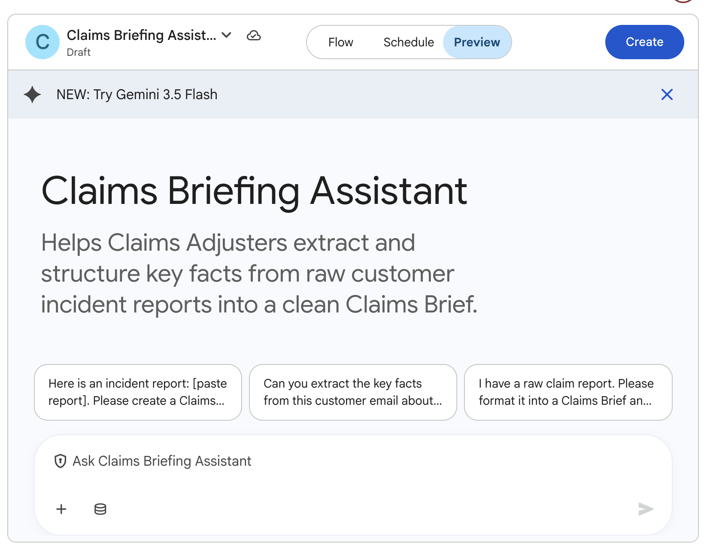
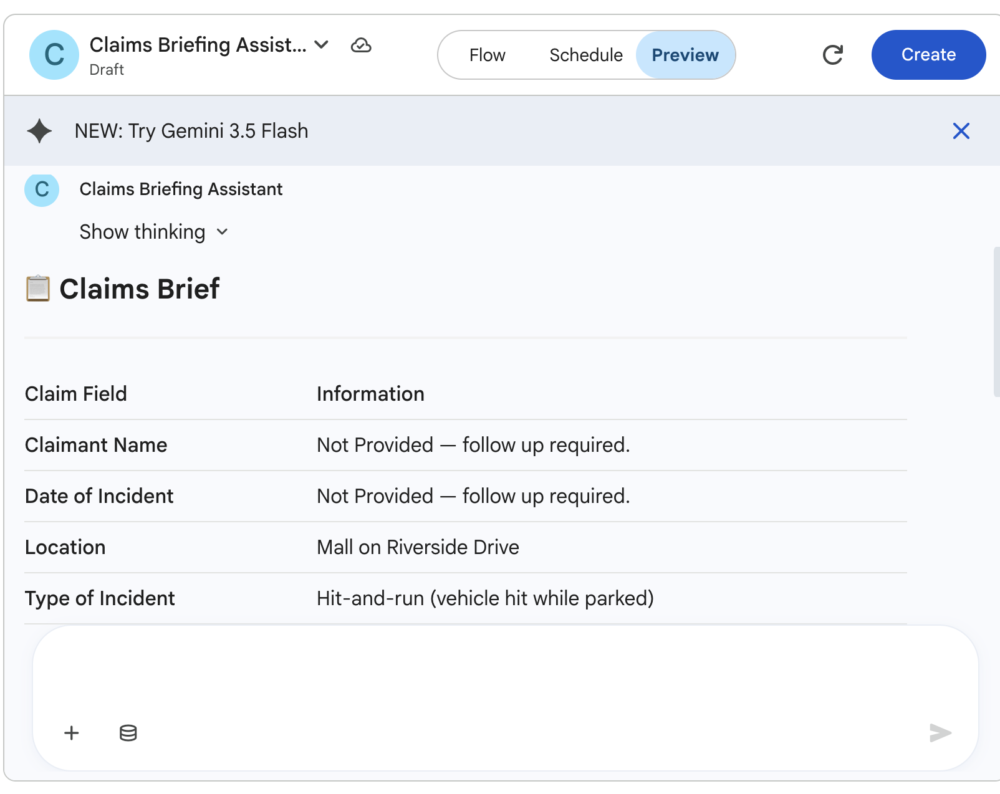
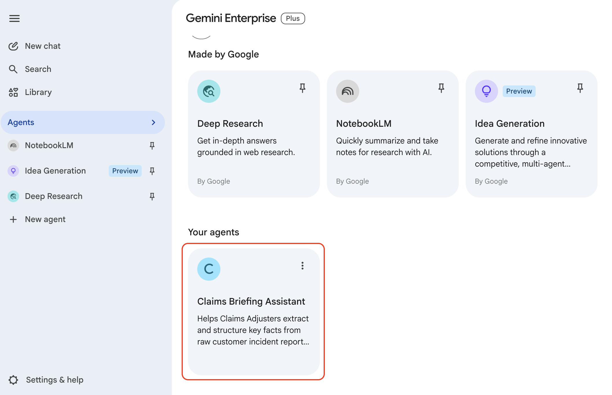
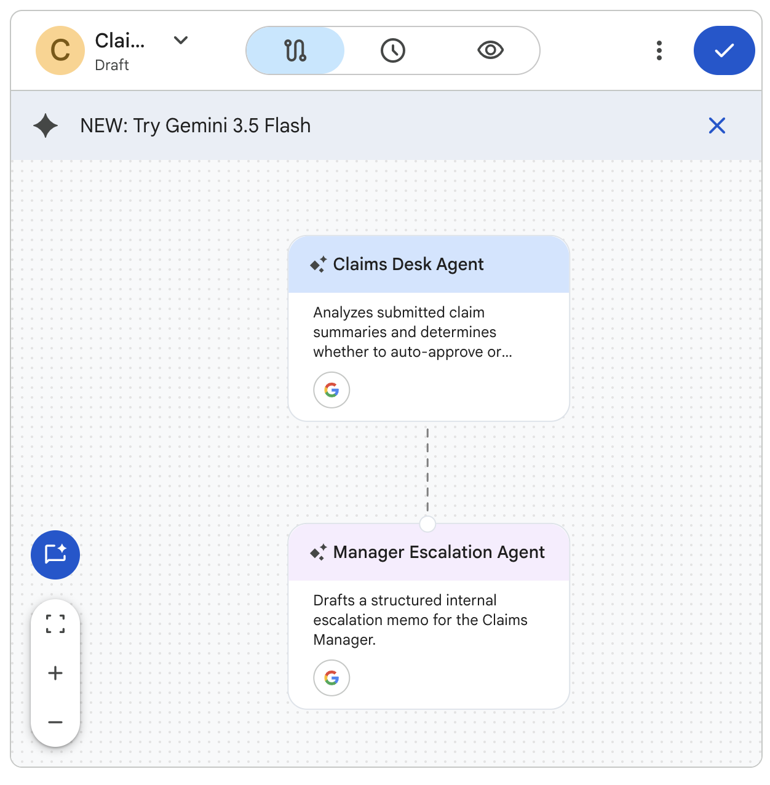

# Creating Simple Agents

## Time Required
20 minutes

## Overview
In this lab, you create two agents using the prompt-based creation method in Gemini Enterprise Agent Designer. You will start with a focused, single-purpose agent and then build a more sophisticated routing agent—all by describing what you want in plain language.

### You learn how to:
- Navigate to the Agent Designer and create an agent using a conversational prompt.
- Write effective agent instructions that produce consistent, structured output.
- Test and refine an agent using the Preview tab.
- Create a multi-step agent that triages inputs and routes them between two distinct roles.

## Scenario

<p align="left">
  
</p>

Cymbal Insurance processes thousands of customer incident reports every day. Claims adjusters currently spend significant time manually reading through unstructured, conversational notes before they can act on a claim. Every minute spent decoding a report is a minute not spent helping a customer.

In this lab, you build two agents that transform this process: one that structures raw incident reports into a standardized brief, and one that automatically triages claims and routes them to the appropriate response.

## Lab Instructions

### Task 1: Create the Claims Briefing Assistant

The Claims Briefing Assistant helps adjusters instantly extract and structure key facts from unformatted incident reports.

1. Open your Gemini Enterprise web app in a browser.

2. In the left navigation menu, click **+ New agent**.

   <p align="left">
     
     <br><em>The + New agent button in the Gemini Enterprise navigation menu</em>
   </p>

3. The **Agent Designer** page opens. In the chat box, paste the following prompt and click the **Submit** icon:

   ```text
   Create an agent called "Claims Briefing Assistant" for Cymbal Insurance.

   This agent helps Claims Adjusters extract and structure key facts from raw, unformatted customer incident reports.

   When an adjuster pastes an incident report, the agent should:
   1. Extract and clearly label these seven fields: Claimant Name, Date of Incident, Location, Type of Incident, Vehicles or Property Involved, Reported Injuries, and Estimated Damage.
   2. If any field is missing or unclear, flag it as "Not Provided — follow up required."
   3. Output a clean, consistently formatted "Claims Brief" using the exact field labels above.
   4. End every brief with a one-sentence "Recommended Next Step" based on the reported severity.

   The agent should be professional and factual. It must not add any information that was not stated in the incident report.
   ```

> [!NOTE]
> Gemini Enterprise analyzes your prompt and may ask clarifying questions before building the agent. If it does, review what it proposes before proceeding.

4. The **Agent Designer canvas** appears with your agent and a live preview pane.

   <p align="left">
     
     <br><em>The Agent Designer canvas showing your new agent and the Preview tab</em>
   </p>

5. Click the **Flow** tab to inspect the generated agent structure. Click the agent node to review the generated **Name**, **Description**, and **Instructions**.

> [!NOTE]
> Review the generated instructions carefully. They should reflect what you described in the prompt. You can edit them directly in the configuration panel if anything needs adjustment.

### Task 2: Test and refine the Claims Briefing Assistant

1. Click the **Preview** tab. The conversational interface for your agent appears on the right.

2. Test the agent with the following sample incident report—paste it into the chat:

   ```text
   Customer called in this morning. Says his car was hit while parked outside the mall on Riverside Drive. They dont know who hit it — someone left a note but never called back. Car is a 2019 Honda Accord. The rear bumper is smashed in and the trunk wont open. They think its about 3 to 4 thousand dollars in damage. No injuries. They have photos they can send.
   ```

3. Review the generated Claims Brief. Ask yourself:
   - Are all seven fields extracted correctly?
   - Are missing fields flagged appropriately?
   - Is the Recommended Next Step specific and actionable?

   <p align="left">
     
     <br><em>The Agent Preview showing the first test response.</em>
   </p>


4. Let's try to improve the agent's output. Use the left chat pane to refine the agent with the following prompt:

   ```text
   Update the instructions so the Recommended Next Steps always specifies one or more concrete actions, such as "Schedule field inspection" or "Request supplemental documentation from claimant" or whatever else is appropriate given the information gathered so far. 
   ```

5. Test again with the updated agent to confirm the refinement worked. Here is another example test prompt.  

```text
Customer Mike Jones called this morning. Says his car was rear-ended on 495 South near mile marker 43. Car is a 2024 Chevy Silverado 1500. The rear bumper is dented and there is damage to the trail gate. A police report was filed by Fairfax Count PD. The other driver's name was Jeff Smith. From Tysons Corner, VA. There were no injuries. They have photos they can send.
```

6. When you are satisfied with the output, click **Create** to launch the agent.

> [!IMPORTANT]
> If you exit the Agent Designer without clicking **Create**, your agent is saved as a **Draft** and will not be available to use until it is launched.

7. Click the __Chat with Agent__ button to open it in a new chat window. Test it again. You can use one of the earlier test prompts or enter your own.

8. Once your agent is deployed, it will be available in the __Agents__ screen in Gemini Enterprise. In the left-hand navigation menu, click **Agents**. You will see your agent in the __Your agents__ section.

   <p align="left">
     
     <br><em>The Claims Briefing Assistant agent deployed in Gemini Enterprise.</em>
   </p>

### Task 3: Create the Claims Escalation Desk

The Claims Escalation Desk is a two-part agent system. A Triage Agent assesses claim severity and determines routing; if escalation is needed, a Manager Escalation Agent drafts a structured internal memo for the Claims Manager.

1. In the navigation menu, click **+ New agent** to open a fresh Agent Designer session.

2. In the chat box, paste the following prompt and click **Submit**:

   ```text
   Create an agent system called "Claims Desk" for Cymbal Insurance. It should work as a two-step routing flow with two agents, the Claims Desk Agent is the root agent that takes requests and the Manager Escalation Agent is a sub-agent. 

   Agent 1 — Claims Desk Agent:
   Analyzes a submitted claim summary and determines the routing based on these rules:
   - AUTO-APPROVE if: estimated damage is under $5,000 AND no injuries are reported AND no third-party liability is indicated.
   - ESCALATE TO MANAGER if: estimated damage is $5,000 or more, OR injuries are reported (any severity), OR third-party liability is indicated.
   Output: routing decision (AUTO-APPROVE or ESCALATE TO MANAGER) and a one-sentence reason.

   Agent 2 — Manager Escalation Agent:
   Only triggered when the Claims Desk Agent escalates a claim.
   Drafts a structured internal escalation memo for the Claims Manager that includes:
   - Memo header: To: Claims Manager | From: Claims Operations System | Re: Escalated Claim
   - Claimant summary: name, date, and claim type
   - Reason for escalation
   - Key risk factors (injuries, high damage estimate, or third-party liability)
   - Recommended next action for the manager
   ```

3. The Agent Designer generates a multi-step agent flow. Click the **Flow** tab to inspect the structure. You should see the root connected to the Manager Escalation Agent.

   <p align="left">
     
     <br><em>The Flow tab showing the Triage Agent routing to the Manager Escalation Agent</em>
   </p>

4. Click the **Preview** tab and test the escalation path with this high-severity claim.

   ```text
   Claim ID: CI-2024-0892
   Claimant: Robert Martinez
   Date of Incident: November 3, 2024
   Incident Type: Multi-vehicle collision
   Vehicles Involved: Claimant's 2021 Ford F-150 and a delivery van
   Reported Injuries: Claimant reports neck pain, taken to hospital
   Estimated Damage: $18,500 vehicle damage + medical costs TBD
   Third-Party Liability: Delivery van driver cited for running a red light
   ```

5. Verify that the Triage Agent routes this claim for escalation and that the Manager Escalation Agent produces a well-structured memo.

6. Now test the auto-approval path.

   ```text
   Claim ID: CI-2024-0901
   Claimant: Sarah Chen
   Date of Incident: November 7, 2024
   Incident Type: Hail damage to parked vehicle
   Vehicles Involved: Claimant's 2020 Toyota Camry
   Reported Injuries: None
   Estimated Damage: $2,100
   Third-Party Liability: None (weather event)
   ```

7. Confirm this claim is routed for auto-approval without triggering an escalation memo.

8. When both paths work correctly, click **Create** to launch the agent.

### Bonus Task 4: Test the boundaries

The escalation rules become interesting at the edges. Use these scenarios to stress-test your routing logic.

1. Test each of the following edge cases and note how the Triage Agent responds:
   - A claim with exactly $5,000 in damage and no other escalation factors—which path does it take?
   - A claim where injuries are "suspected but not confirmed"
   - An incomplete report where the damage estimate is missing entirely

2. If the routing logic does not behave as expected, open the agent for editing. In the **Agent Gallery**, find **Claims Escalation Desk** in the **Your agents** section, click **Actions**, and select **Edit**.

3. Use the left chat pane to adjust the thresholds or clarify the language:

   ```text
   Update the Triage Agent so that "suspected injuries" and damage of exactly $5,000 are both treated as escalation triggers. Also add a rule: if the estimated damage is missing entirely, escalate to manager.
   ```

4. Click **Reset session** to save and relaunch the agent. Retest the edge cases to confirm the changes took effect.

## Congratulations!

In this lab, you have:
- Created two agents using the prompt-based method in Gemini Enterprise Agent Designer.
- Written agent instructions that produce consistent, structured output.
- Tested and refined agents using the Preview tab.
- Built a multi-step agent that triages inputs and routes them between two distinct roles.
