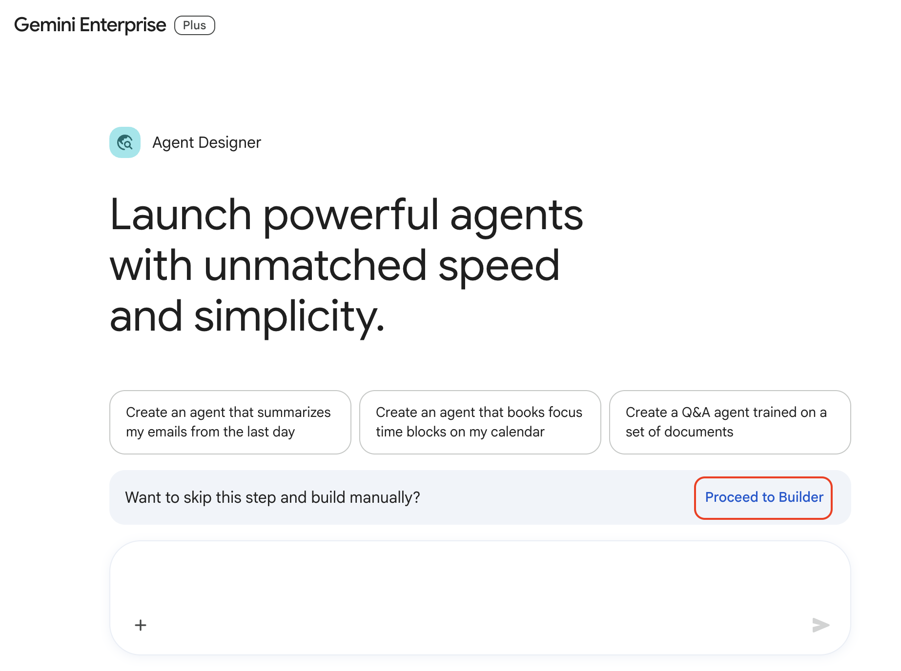
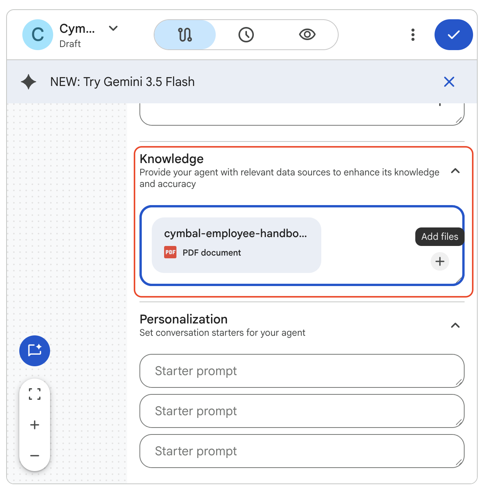

# Creating Agents with the Agent Designer

## Time Required
30 minutes

## Overview
In this lab, you use the Agent Designer's flow builder to manually configure two knowledge-grounded agents. Unlike the prompt-based method, the flow builder gives you direct control over every aspect of the agent: its instructions, model, uploaded knowledge documents, and starter prompts.

### You learn how to:
- Create an agent using the Agent Designer flow builder.
- Upload a knowledge document to ground an agent's responses in a specific source.
- Configure starter prompts that guide users to the most common tasks.
- Build a compliance-focused agent that audits content against a policy document.

## Scenario

<p align="left">
  
</p>

Cymbal Insurance's HR and Finance teams face the same underlying problem: employees keep asking questions that are already answered in official policy documents, and expense reports arrive that haven't been checked against the corporate policy. Both problems are expensive to solve with human effort alone.

In this lab, you build two agents that put those policy documents to work—one that answers employee HR questions instantly, and one that audits expense reports before they reach the finance team.

## Before You Begin

Both agents in this lab require a PDF knowledge document. You will create these from the sample content provided in each task.

For each document:
1. Open [Google Docs](https://docs.google.com) and create a new blank document.
2. Paste the sample content provided in the task.
3. Download as a PDF: **File > Download > PDF Document (.pdf)**.
4. Save the file using the filename specified in the task.

## Lab Instructions

### Task 1: Prepare the Employee Handbook and create the Employee Navigator

1. Create a new Google Doc, paste the following content, and download it as **`cymbal-employee-handbook.pdf`**:

   ```text
   CYMBAL INSURANCE—EMPLOYEE HANDBOOK (Summary Edition)

   PTO POLICY
   Full-time employees accrue 15 PTO days per year in their first three years of employment. After three years, accrual increases to 20 days per year. PTO must be approved by your direct manager at least 5 business days in advance for absences of 3 or more consecutive days. Up to 5 unused PTO days may be carried over to the following calendar year.

   COMPANY HOLIDAYS
   Cymbal Insurance observes the following paid holidays each year: New Year's Day, Martin Luther King Jr. Day, Presidents' Day, Memorial Day, Juneteenth, Independence Day, Labor Day, Thanksgiving Day, the day after Thanksgiving, Christmas Eve, and Christmas Day.

   HEALTH BENEFITS
   All full-time employees are eligible for health, dental, and vision coverage beginning on their first day of employment. Open enrollment occurs each November for coverage effective January 1. Employees may add dependents during open enrollment or within 30 days of a qualifying life event (marriage, birth, adoption).

   PERFORMANCE REVIEWS
   Performance reviews are conducted twice per year: mid-year in July and year-end in December. Reviews include a self-assessment, a manager assessment, and a development planning conversation. Ratings range from 1 (Below Expectations) to 5 (Exceptional).

   401(K) PLAN
   Cymbal Insurance matches 100% of employee contributions up to 4% of base salary. Employees are eligible to enroll after 90 days of employment. Vesting is immediate for employee contributions; the employer match vests over 3 years.

   WORKPLACE CONDUCT
   Cymbal Insurance maintains a zero-tolerance policy for harassment, discrimination, and retaliation of any kind. All employees are required to complete annual compliance training. Violations should be reported to HR or through the confidential Ethics Hotline at 1-800-555-0199.
   ```

2. Open your Gemini Enterprise web app and click **+ New agent** in the navigation menu.

3. On the Agent Designer page, click **Proceed to Builder** to open the flow builder directly.

   <p align="left">
     
     <br><em>Click Proceed to Builder to open the Flow tab directly</em>
   </p>

4. The **Flow** tab opens with a default agent node. Click the node to open its configuration panel on the right.

5. Configure the agent with the following values:
   - **Name:** `Cymbal Employee Navigator`
   - **Description:** `Internal HR assistant grounded in the Cymbal Insurance Employee Handbook.`
   - **Instructions:** Paste the following:

   ```text
   You are the Cymbal Employee Navigator, an internal HR assistant for Cymbal Insurance employees.

   Answer questions using only the information in the uploaded Employee Handbook document.

   Guidelines:
   - Provide clear, accurate answers about PTO, company holidays, health benefits, performance reviews, the 401(k) plan, and workplace conduct.
   - If the answer to a question is not in the Employee Handbook, respond: "I don't have that information in the Employee Handbook. Please contact HR directly."
   - Never guess or invent policy details. If you are uncertain, say so.
   - Keep responses friendly, concise, and easy to understand.
   - If a question is ambiguous, ask one clarifying question before answering.
   ```

   - **Model:** Leave the default model selected.

6. Scroll to the **Knowledge** section of the configuration panel. Click **Add files** and upload `cymbal-employee-handbook.pdf`.

   <p align="left">
     
     <br><em>The Knowledge section after uploading the Employee Handbook PDF</em>
   </p>

7. Scroll to the **Personalization** section and add the following starter prompts:
   - `How many PTO days do I get?`
   - `When are the company holidays?`
   - `How does the 401(k) match work?`

> [!NOTE]
> Starter prompts help by giving examples of how the agent can be used, and allow you to just click on commonly used prompts.

### Task 2: Test the Employee Navigator

1. Click the **Preview** tab.

2. Confirm that starter prompts appear. Click one to verify it triggers a relevant response.

3. Ask the following questions and evaluate the quality of each response:
   - "How many PTO days do I get if I've been here for four years?"
   - "Can I roll over unused PTO to next year?"
   - "When is open enrollment for health benefits?"
   - "What happens if I miss the 401(k) enrollment window?"

4. Now test the agent's grounding by asking something the handbook does not cover:
   - "What is the dress code policy?"

> [!NOTE]
> The agent should respond that the information is not available in the Employee Handbook and direct the user to HR—not hallucinate an answer. This is the expected behavior for a well-grounded agent.

5. If any response is inaccurate or off-topic, click the **Flow** tab, open the agent node, and update the instructions. You can also type a refinement in the left chat pane:

   ```text
   Update the instructions to ensure the agent always cites the specific section of the Employee Handbook when answering questions about PTO, benefits, or performance reviews.
   ```

6. When you are satisfied with the responses, click **Create** to launch the agent.

### Task 3: Create the Expense Policy Auditor

1. Create a new Google Doc, paste the following content, and download it as **`cymbal-expense-policy.pdf`**:

   ```text
   CYMBAL INSURANCE—TRAVEL & EXPENSE POLICY (Summary Edition)

   AIRFARE
   Economy class is required for all flights under 6 hours. Business class is permitted for flights of 6 hours or more with VP-level approval. Airfare should be booked at least 14 days in advance when possible. Maximum reimbursable domestic airfare: $600 roundtrip.

   HOTELS
   Maximum reimbursable hotel rate: $200 per night in standard cities; $275 per night in high-cost cities (New York, San Francisco, Chicago, Los Angeles, Washington D.C., and Boston). Employees must book hotels through the company's approved travel portal.

   MEALS
   Individual meals: up to $75 per day total (all meals combined). Team meals where the employee is the host: up to $50 per person, maximum 8 people covered per meal. Client meals: up to $100 per person; requires manager pre-approval and must include the client's name and company in the expense report.

   NON-REIMBURSABLE EXPENSES
   The following are not reimbursable under any circumstances: personal entertainment (in-room movies, streaming services, minibar), gym and spa fees, alcohol purchased separately (alcohol is permitted within team and client meal per-person limits), clothing, personal care items, and traffic or parking fines.

   RECEIPTS
   All expenses over $25 require an itemized receipt. Expenses over $25 submitted without a receipt will be automatically rejected. All receipts must be attached to the expense report within 30 days of the expense date.

   CONFERENCE AND REGISTRATION FEES
   Pre-approved conference registration fees are fully reimbursable. Written approval must be obtained before registration. Unapproved registrations will not be reimbursed.
   ```

2. In your Gemini Enterprise web app, click **+ New agent** and then click **Proceed to Builder**.

3. Click the default agent node and configure it:
   - **Name:** `Expense Policy Auditor`
   - **Description:** `Audits employee expense reports against the Cymbal Insurance T&E Policy before submission.`
   - **Instructions:** Paste the following:

   ```text
   You are the Expense Policy Auditor for Cymbal Insurance.

   You are grounded in the corporate Travel & Expense (T&E) Policy document. When an employee submits their expense list, do the following:

   1. Review each expense line against the T&E Policy.
   2. Mark each line as one of:
      - ✅ COMPLIANT
      - ❌ NON-COMPLIANT — include the specific policy rule that was violated and the maximum reimbursable amount, if applicable
      - ⚠️ NEEDS CLARIFICATION — if required information is missing (receipt, client name, pre-approval)
   3. Output a structured "Expense Audit Report" with:
      - Each expense line with its compliance status
      - A Summary section: Total Claimed | Total Approved | Total Flagged
   4. End with a one-sentence recommendation for the employee.

   Be precise and professional. Reference the specific policy rule for every non-compliant flag. Do not approve expenses that violate policy.
   ```

4. In the **Knowledge** section, click **Add files** and upload `cymbal-expense-policy.pdf`.

5. Click the **Preview** tab and test with the following expense submission:

   ```text
   Trip: Chicago Sales Conference, November 4–6, 2024

   Airfare (roundtrip, economy, booked 3 weeks out): $485
   Hotel (2 nights at $250/night): $500 total
   Team dinner (8 people, employee is host): $620 total
   Client lunch with J. Brooks (Apex Corp): $95
   Taxi to airport: $45
   Personal dinner: $78
   Minibar charges: $34
   In-room movie: $18
   Conference registration (pre-approved): $300
   ```

6. Review the audit report and verify that the following issues are caught:
   - Hotel exceeds the $200/night limit for standard cities ($250/night was charged)
   - Team dinner exceeds the $50/person limit ($77.50/person for 8 people)
   - Minibar charges are non-reimbursable
   - In-room movie is non-reimbursable

7. Click **Create** to launch the agent.

8. Start a chat with the agent and ask the following questions:

```
What are the rules and limits for buying dinners for clients?
```

```
I want to take a large client to a sporting event. What do I need to do to expense that?
```

### Bonus Task 4: Refine and extend

1. Open the **Expense Policy Auditor** for editing. In the **Agent Gallery**, go to **Your agents**, find the agent, click **Actions**, and select **Edit**.

2. Use the left chat pane to request an output format improvement:

   ```text
   Update the Expense Audit Report to include a "Steps to Resubmit" section at the end. This section should list the specific changes the employee must make to each flagged item before resubmitting the report.
   ```

3. Test the updated format with the same expense submission from Task 3. Verify the new section appears and is actionable.

4. Add a couple starter prompts to the Expense Policy Auditor agent.

5. Review the agent's instructions. Modify them any way you like to add capabilities or refine the outputs. Test after each change. 

## Congratulations!

In this lab, you have:
- Created agents using the Agent Designer flow builder with manual configuration.
- Uploaded knowledge documents to ground agent responses in specific source material.
- Configured starter prompts to guide users to the most common tasks.
- Built a compliance-focused agent that generates structured expense audit reports.
