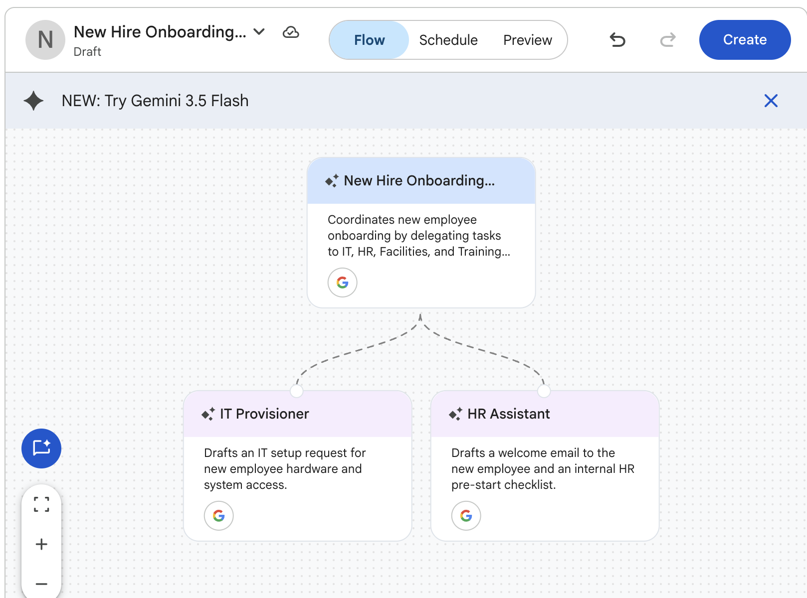
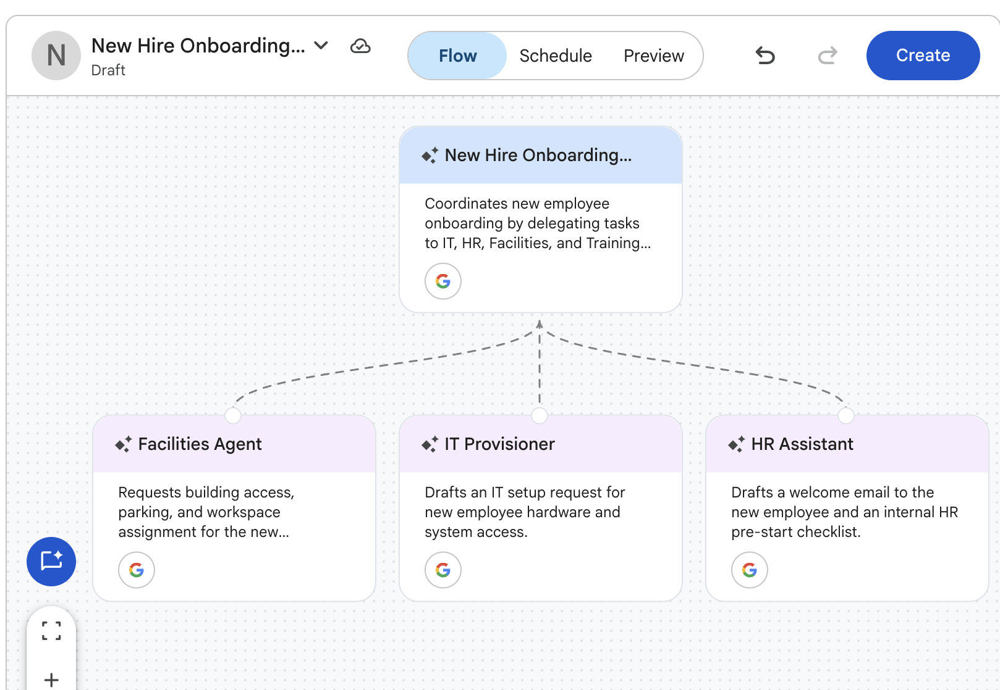

# Creating Multi-Agent Systems

## Time Required
30 minutes

## Overview
In this lab, you use the Agent Designer to build a multi-agent system. You will create a root Orchestrator Agent and three specialized sub-agents, each responsible for a distinct part of the new employee onboarding process. The Orchestrator delegates to all three simultaneously and assembles their outputs into a single, unified summary. In the bonus, you will extend the system by designing and adding a fourth sub-agent on your own.

### You learn how to:
- Design a multi-agent system with a root orchestrator and specialized sub-agents.
- Add and configure sub-agents in the flow builder.
- Write routing logic that delegates tasks to the right agent.
- Test a multi-agent flow end to end with realistic input.

## Scenario

<p align="left">
  
</p>

Every time a new employee joins Cymbal Insurance, the same process plays out across four separate departments: IT sets up equipment and system access, HR sends paperwork and a welcome email, Facilities assigns a badge and workspace, and Training schedules the first week of orientation. Today, each team learns about a new hire independently—often late. The result is a fragmented onboarding experience where equipment isn't ready, badges aren't printed, and new employees spend their first day waiting.

In this lab, you build a single Orchestrator Agent that takes new hire details and coordinates all four departments in one step.

## Lab Instructions

### Task 1: Create the Orchestrator Agent

1. Open your Gemini Enterprise web app and click **+ New agent** in the left navigation menu.

<p align="left">
  
</p>

2. On the Agent Designer page, click **Proceed to Builder**.

3. The **Flow** tab opens with a default agent node. Click the node to open its configuration panel. Configure the Orchestrator by pasting the following:

   - **Name:** 
   ```
   New Hire Onboarding Orchestrator
   ```
   - **Description:**
   ```
   Coordinates new employee onboarding by delegating tasks to IT, HR, and Facilities sub-agents.
   ```
   - **Instructions:** 
   ```text
   You are the New Hire Onboarding Orchestrator for Cymbal Insurance.

   When you receive new employee details, do the following:

   1. Confirm you have all five required fields: full name, start date, role, department, and office location. If any are missing, ask for them before proceeding.

   2. Once you have all required information, delegate onboarding tasks to all three sub-agents simultaneously:
      - IT Provisioner: hardware, software, and system access setup
      - HR Assistant: welcome email to the employee and internal HR checklist
      - Facilities Agent: building access badge, parking, and workspace assignment

   3. Collect all three sub-agent outputs and present them as a single "New Hire Onboarding Summary" with a clearly labeled section for each department.

   Do not skip any sub-agent, even if details about a particular department were not explicitly requested.
   ```

   - **Model:** Leave the default model selected.

4. Do not click **Create** yet. You need to add the sub-agents before launching.

> [!IMPORTANT]
> If you exit the Agent Designer at this point, your agent will be saved as a **Draft**. You can reopen it from **Agent Gallery > Your agents** and continue from where you left off.

### Task 2: Add the IT Provisioner and HR Assistant

1. In the **Flow** tab, hover over the **New Hire Onboarding Orchestrator** node. A **+ Add a sub-agent** button appears. Click it.

   <p align="left">
     
     <br><em>Hover over the Orchestrator node to reveal the + Add a sub-agent button</em>
   </p>

2. A new sub-agent node appears on the canvas. Click the node and configure it:
   - **Name:**
   ```
   IT Provisioner
   ```
   - **Description:**
   ```
   Drafts an IT setup request for new employee hardware and system access.
   ```

   - **Instructions:**
   ```text
   You are the IT Provisioner sub-agent for Cymbal Insurance's onboarding system.

   You receive new hire details from the Orchestrator. Draft a professional email to the IT department to set up the new employee's equipment and system access.

   The email must include:
   - Subject line: "New Hire IT Setup Request — [Full Name], Start Date: [Date]"
   - Hardware: standard laptop and accessories (request high-performance setup if the role is in Engineering, Data Science, or Analytics)
   - Software: standard productivity suite, corporate email account, VPN client, and any role-specific applications
   - System access: Active Directory account creation, network access, and shared drives appropriate for the department
   - Priority: flag as URGENT if the start date is within 5 business days

   Keep the tone direct and professional.
   ```

3. In the **Flow** tab, hover over the Orchestrator node again and click **+ Add a sub-agent** to add a second sub-agent. Configure it:
   - **Name:**
   ```
   HR Assistant
   ```
   - **Description:**
   ```
   Drafts a welcome email to the new employee and an internal HR pre-start checklist.
   ```
   - **Instructions:**
   ```text
   You are the HR Assistant sub-agent for Cymbal Insurance's onboarding system.

   You receive new hire details from the Orchestrator. Produce two items:

   1. Welcome Email to the new employee:
      - Warmly welcome them to Cymbal Insurance by name
      - Confirm their start date, office location, and first-day arrival time (9:00 AM unless otherwise noted)
      - Let them know their manager will be in touch shortly with first-week details
      - Professional but warm tone

   2. Internal HR Checklist email to the HR team:
      - Subject: "New Hire Pre-Start Checklist — [Full Name], Starting [Date]"
      - Items: offer letter confirmation on file, benefits enrollment packet to send, I-9 documentation to collect, direct deposit form, employee badge request submitted to Facilities
      - Flag any items that must be completed before the start date
   ```

4. The **Flow** tab should now show the Orchestrator connected to two sub-agents.

   <p align="left">
     
     <br><em>The flow after adding IT Provisioner and HR Assistant sub-agents</em>
   </p>

### Task 3: Add the Facilities Agent, then test

1. Hover over the Orchestrator node and click **+ Add a sub-agent** to add the third sub-agent:
   - **Name:**
   ```
   Facilities Agent
   ```
   - **Description:**
   ```
   Requests building access, parking, and workspace assignment for the new employee.
   ```
   - **Instructions:**
   ```text
   You are the Facilities Agent sub-agent for Cymbal Insurance's onboarding system.

   You receive new hire details from the Orchestrator. Draft an email to the Facilities team.

   The email must include:
   - Subject: "New Hire Facilities Setup — [Full Name], Start Date: [Date]"
   - Building access badge request for the employee's primary office location
   - Parking: confirm availability and provide instructions for the parking registration process
   - Workspace: assign a standard desk in the employee's department area; note any special requirements (standing desk, accessibility accommodations) if mentioned in the new hire details
   - Flag as URGENT if the start date is within 5 business days
   ```

2. The **Flow** tab should now show all three sub-agents connected to the Orchestrator.

   <p align="left">
     
     <br><em>The flow after adding all three sub-agents: IT Provisioner, HR Assistant, and Facilities Agent</em>
   </p>

3. Click the **Preview** tab. Test the system with the following new hire details:

   ```text
   New hire details:
   - Full Name: Maria Santos
   - Start Date: June 2, 2025
   - Role: Claims Analyst
   - Department: Property Claims
   - Office Location: Austin, TX
   ```

4. Verify that the Onboarding Summary contains all three sections and that each is appropriate for Maria's role:
   - **IT:** Does it request the right hardware and software for a Claims Analyst? Is it flagged URGENT based on the start date?
   - **HR:** Does the welcome email address Maria by name and confirm her start details? Does the checklist cover all five items?
   - **Facilities:** Does it include badge access, parking, and workspace for the Austin office?

5. If any sub-agent's output is weak or missing, click the **Flow** tab, select that sub-agent's node, and refine its instructions.

6. When all three sections are working correctly, click **Create** to launch the system.

7. Start a chat with the new agent and test it with the following prompt. Notice, there is a missing start date, let's see how the agent responds. 

```
We just hired a new programmer in the IT department. His name is John Opiola. He will be working in the Reston, VA office. 
```


### Bonus Task 4: Add the Training Coordinator

The system is working but onboarding at Cymbal Insurance involves four departments, not three. In this bonus, you add the Training Coordinator sub-agent yourself, using the agents you have already built as your guide.

1. Open the agent for editing. In the **Agent Gallery**, go to **Your agents**, find **New Hire Onboarding Orchestrator**, click **Actions**, and select **Edit**.

2. In the **Flow** tab, hover over the Orchestrator node and click **+ Add a sub-agent**.

3. Configure the sub-agent's name and description, then write the instructions yourself. Use the IT Provisioner, HR Assistant, and Facilities Agent as your guide for structure and tone. The Training Coordinator should produce:
   - A structured first-week onboarding schedule with a clear agenda for each day
   - A brief welcome note to the new employee explaining what to expect and what to bring on Day 1

4. Once the sub-agent is configured, open the **Orchestrator** node and update its instructions to include the Training Coordinator as a fourth delegation target and add a Training section to the final summary.

> [!NOTE]
> This step is essential. The Orchestrator's instructions are the routing logic for the entire system. Without updating them, the Orchestrator will not know the Training Coordinator exists and will not call it.

5. Click the **Preview** tab and test with Maria Santos again. Confirm that the Onboarding Summary now includes all four sections, with a well-structured Training schedule.

6. When you are satisfied, click **Reset Session** to save and relaunch the system.

**Take it further:** Test the complete four-agent system with a more complex scenario:

```text
New hire details:
- Full Name: David Kim
- Start Date: [3 business days from today]
- Role: Senior Data Engineer
- Department: Analytics & Data Science
- Office Location: New York, NY
- Special requirements: standing desk, high-performance laptop
```

Verify that the IT Provisioner flags URGENT and requests a high-performance setup, and that the Facilities Agent notes the standing desk requirement. Then test what the Orchestrator does with incomplete input:

```text
I need to onboard Alex Rivera starting March 10.
```

The Orchestrator should ask for the missing required fields before proceeding.

## Congratulations!

In this lab, you have:
- Designed a multi-agent system with a root orchestrator and specialized sub-agents.
- Added and configured sub-agents using the flow builder.
- Written routing logic that delegates tasks to the right agent simultaneously.
- Tested a multi-agent flow end to end with realistic and edge-case input.
