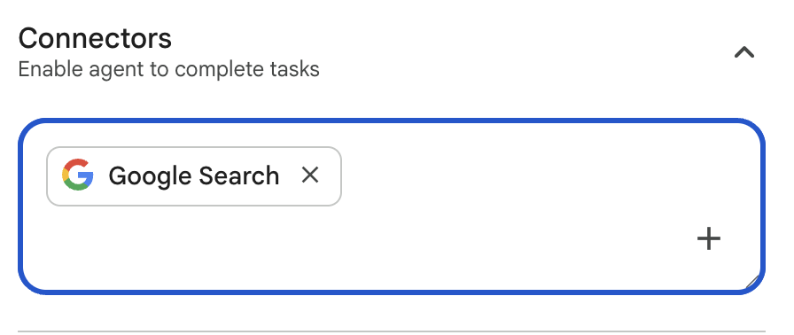
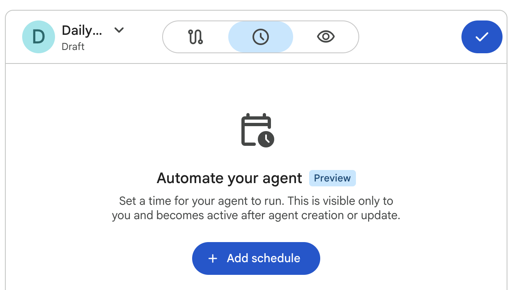
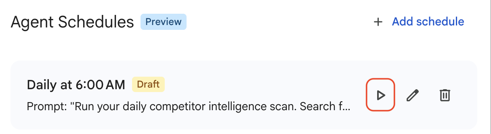
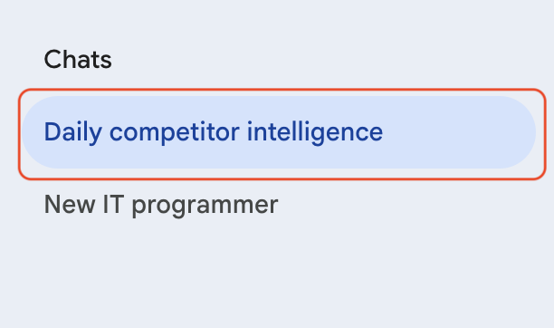

# Scheduling Agents for Autonomous Workflows

## Time Required
30 minutes

## Overview
In this lab, you create an agent that runs automatically on a recurring schedule—no human trigger required. By connecting it to the Google Search tool, the agent becomes an autonomous intelligence service that gathers and synthesizes real-time information on a schedule you define, and delivers a formatted report ready for leadership review.

### You learn how to:
- Create an agent that uses the Google Search tool to access current web content.
- Configure a recurring execution schedule with a specific prompt.
- Test a scheduled agent before its first automatic run using the Preview function.
- Monitor scheduled agent runs in the chat history.

## Scenario

<p align="left">
  
</p>

Cymbal Insurance's leadership team needs to stay current on competitor activity—product launches, pricing changes, regulatory actions, and strategic moves. Today, this responsibility falls on individual analysts who manually search the web and write briefings. The process is inconsistent, time-consuming, and often skipped entirely on busy mornings.

In this lab, you build an autonomous Competitor Intel Analyst that searches the web every morning and delivers a formatted Executive News Brief before anyone arrives at their desk.

## Lab Instructions

### Task 1: Create the Competitor Intel Analyst

1. Open your Gemini Enterprise web app and click **+ New agent** in the navigation menu.

2. On the Agent Designer page, click **Proceed to Builder** to open the flow builder.

3. Click the default agent node to open its configuration panel. Configure the agent by pasting the following:
   - **Name:**
   ```
   Daily Competitor Intel Analyst
   ```
   - **Description:**
   ```
   Autonomous agent that scans for overnight competitor news and generates a formatted Executive News Brief each morning.
   ```
   - **Instructions:**
   ```text
   You are the Daily Competitor Intel Analyst for Cymbal Insurance.

   When triggered, use the Google Search tool to find news published in the last 24 hours about Cymbal Insurance's top competitors: Nationwide, State Farm, Allstate, Progressive, and GEICO.

   For each competitor with notable news:
   1. Summarize the key development in 2–3 sentences.
   2. Identify the type of development: product launch, pricing change, regulatory action, leadership change, financial news, or strategic move.

   Format your output as an "Executive News Brief" with:
   - Report header: "Cymbal Insurance — Competitor Intelligence Brief" followed by the current date and time
   - One section per competitor that has noteworthy news (skip competitors with no notable activity in the last 24 hours)
   - For competitors with no news: "[Competitor Name] — No significant activity in the last 24 hours."
   - A "Key Takeaways" section at the end with exactly 3 bullet points summarizing the most important developments across all competitors
   - Use ⚠️ to flag any item that may require immediate attention from leadership

   Keep the brief concise—no more than one page. Use a professional tone suitable for senior leadership.
   ```

   - **Model:** Leave the default model selected.

4. Notice, in the __Connectors__ section the **Google Search** tool should be included by default. It it is not for some reason, click the **+** button to enable it.


   <p align="left">
     
     <br><em>Enable the Google Search tool in the Data and tools section</em>
   </p>

> [!NOTE]
> The Google Search tool allows the agent to access real-time web content. Without it, the agent can only draw on its training data and cannot find overnight news.

### Task 2: Configure the schedule

1. In the Agent Designer canvas, click the **Schedule** tab.

   <p align="left">
     
     <br><em>The Schedule tab where you configure recurring execution</em>
   </p>

2. Click **+ Add schedule** and configure the following:
   - **Repeat frequency:** Daily
   - **Execution time:** 6:00 AM
   - **Timezone:** Select your local timezone
   - **Prompt:** Paste the following:

   ```text
   Run your daily competitor intelligence scan. Search for the latest news about Nationwide, State Farm, Allstate, Progressive, and GEICO from the past 24 hours. Generate and deliver the Executive News Brief now.
   ```

3. Click **Add schedule** to save the schedule.

> [!NOTE]
> The schedule is saved but not yet active. It activates when you click **Create** in the next step.

4. Before launching, test the agent by clicking **Run in preview** on the schedule card. This triggers the agent immediately using the saved schedule prompt so you can verify the output before the first automatic run.

   <p align="left">
     
     <br><em>Use Run in preview to test the scheduled agent immediately</em>
   </p>

 > [!NOTE]
 > It may take 30–60 seconds for the agent to complete its web searches and generate the brief. This is normal, the agent is running live search queries.

5. Review the Executive News Brief in the Preview tab. Evaluate:
   - Are all five competitors represented or noted with "No significant activity"?
   - Are the summaries factual and concise?
   - Does the Key Takeaways section identify the three most important developments?
   - Is the ⚠️ flag used appropriately and not overused?

6. If the output needs improvement, use the left chat pane to refine the agent:

   ```text
   Update the instructions so the Key Takeaways section explicitly ranks the three items from most to least significant, and explains briefly why each is important for Cymbal Insurance.
   ```

### Task 3: Launch and monitor the agent

1. Click **Create** to launch the agent and activate the daily schedule.

2. Navigate to the **Agent Gallery** by clicking **Agents** in the left navigation menu.

3. Confirm that the **Daily Competitor Intel Analyst** appears in the **Your agents** section with an active status. Start a chat with it, and ask it the following (_this is the same prompt as was in the schedule_).

```text
Run your daily competitor intelligence scan. Search for the latest news about Nationwide, State Farm, Allstate, Progressive, and GEICO from the past 24 hours. Generate and deliver the Executive News Brief now.
```

4. Runs whether they are scheduled or executed manually will appear in the chat history. Go to the **Chats** section in the navigation menu. Each scheduled run appears as a conversation thread in your chat history.

   <p align="left">
     
     <br><em>Chat history with scheduled runs</em>
   </p>

> [!NOTE]
> In a production deployment of Gemini Enterprise, you can enable an email connector. This would allow you to schedule an agent like this and email the results to yourself.

### Bonus Task 4: Build the Morning Risk & Exposure Monitor

The Claims Department faces a different kind of information need: knowing about severe weather and natural disasters before the phone lines light up. Build a second scheduled agent that runs alongside the Competitor Intel Brief.

1. Click **+ Create agent** and proceed to the builder.

2. Configure the agent:
   - **Name:**
   ```
   Morning Risk & Exposure Monitor
   ```
   - **Description:**
   ```
   Scans for overnight severe weather and disaster events to help the Claims team prepare for high-volume days.
   ```
   - **Instructions:**
   ```text
   You are the Morning Risk & Exposure Monitor for Cymbal Insurance's Claims Department.

   When triggered, use the Google Search tool to find news from the last 24 hours about severe weather events, natural disasters, and major accidents across the United States that could generate a high volume of insurance claims.

   Search for: severe storms, tornadoes, wildfires, floods, hurricanes, hailstorms, earthquakes, and major multi-vehicle accidents.

   For each significant event found, record:
   - Location and affected area
   - Event type and severity description
   - Estimated number of properties or vehicles potentially affected
   - Estimated claims impact: LOW / MEDIUM / HIGH / CRITICAL

   Format your output as a "Daily Risk Alert" with:
   - Report header: "Cymbal Insurance—Morning Risk Alert" followed by the current date
   - Events listed in order of estimated claims impact (highest first)
   - A "Claims Department Action Items" section with 2–3 specific preparation recommendations
   - An overall risk level for the day: LOW / MEDIUM / HIGH / CRITICAL

   If no significant events are found: "No significant weather or disaster events detected in the last 24 hours. Risk level: LOW."
   ```

3. Enable the **Google Search** tool in the **Data and tools** section.

4. Click the **Schedule** tab and configure a daily schedule at **6:15 AM** (15 minutes after the Competitor Intel Brief, so both reports are ready before the workday begins):
   - **Prompt:**
   ```
   Run your morning risk scan. Search for overnight severe weather, natural disasters, and major accidents across the US from the last 24 hours. Generate and deliver the Daily Risk Alert now.
   ```
   
5. Click **Run in preview** to test, then click **Create** to activate the agent.

## Congratulations!

In this lab, you have:
- Created an agent that uses the Google Search tool to access real-time web content.
- Configured a recurring daily schedule with a specific execution prompt.
- Tested a scheduled agent using the Run in preview function before activation.
- Monitored scheduled runs in the chat history and learned the credentials refresh requirement.
