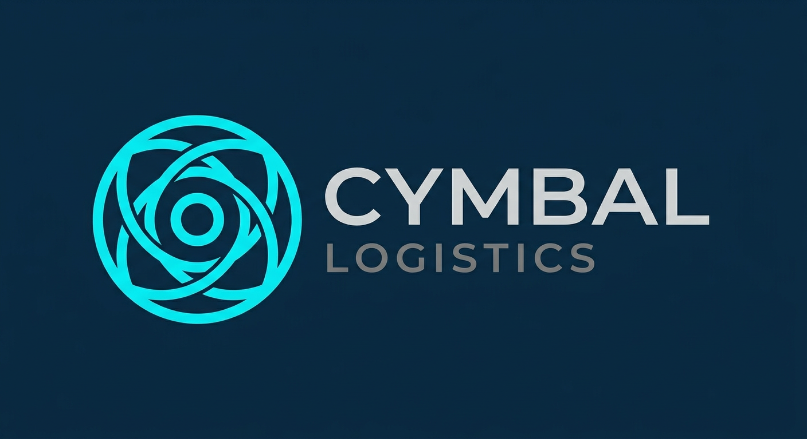
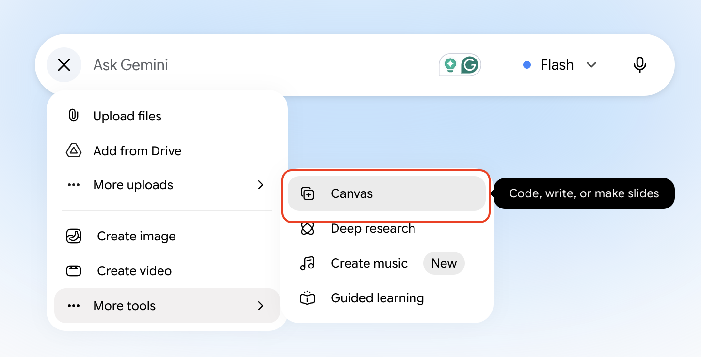
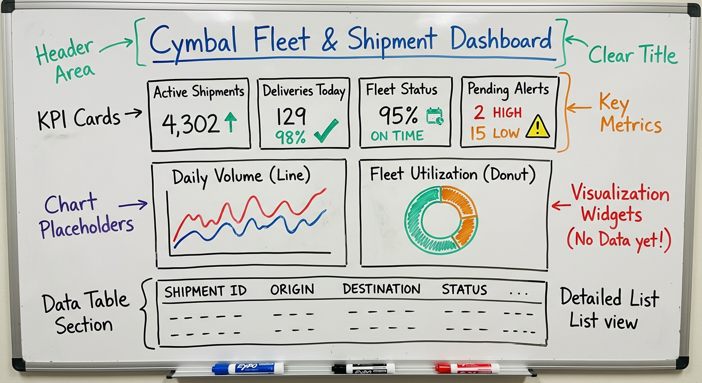

# UX Design: Image to Code

## Time Required
20 minutes

## Overview
In this lab, you use a rough, hand-drawn sketch to generate the first iteration of the Cymbal Fleet & Shipment dashboard using Gemini Canvas. 

### You learn how to:
- Translate a low-fidelity UI sketch into a structured web layout.
- Prompt Gemini Canvas to generate functional HTML, CSS, and JavaScript from an image.
- Refine and iterate on a generated interface through focused prompting.

## Scenario

<p align="left">
  
</p>

Cymbal Logistics is modernizing its back-office operations. The team wants a Fleet & Shipment dashboard to help managers quickly assess daily shipment performance. 

This application will empower logistics managers to scan the day’s shipment activity, catch delays or exceptions, and review operational summaries at a glance. 

### Dashboard design
The UI dashboard should include easy-to-read status cards which include the following metrics:
- Active shipments
- Deliveries today
- Fleet status
- Pending alerts

Users also want charts which display volume and fleet utilization. There should be a grid with active shipments and the ability to add new shipments. 

## Lab Instructions

### Task 1: Sketch the UI design

Before writing any code, grab a piece of paper and a pen (or a digital whiteboard) and sketch out your vision for the dashboard based on the scenario. 

1. Review the scenario description above. 

2. Draw a rough wireframe that includes these core structural regions:
   - A header and title area
   - A row of KPI (Key Performance Indicator) cards
   - Two distinct chart placeholders
   - A data table section at the bottom

> [!IMPORTANT] 
> Ignore fine visual details for now. Focus entirely on the structure and layout of the page.

### Task 2: Upload the sketch and generate the initial UI
Now, let's bring the sketch to life in Canvas. 

1. Open [Gemini](https://gemini.google.com/app), click the __+__ icon, and select **Canvas** from the __Tools__ list. 

   <p align="left">
     
     <br>
     <em>Tools | Canvas menu</em>
   </p>

2. Take a photo of your sketch and send it to yourself. Then, paste it into your Gemini prompt window. Alternatively, you can use the example sketch below. Right-click the sketch, copy it, and paste it into your prompt:

   <p align="left">
     
     <br>
     <em>Cymbal Fleet &amp; Shipment Dashboard—wireframe sketch</em>
   </p>

3. Start small. Try a very brief, basic prompt to see how Gemini interprets the image natively.

```text
Program this dashboard.
```

4. It will take a little while to complete. 

   <p align="left">
     
     <br>
     <em>Gemini Canvas generating the dashboard code</em>
   </p>

5. While it is working, you can click the __Code__ tab of the __Canvas__ and watch the code being generated. 

   <p align="left">
     
     <br>
     <em>Viewing the generated code in the Code tab</em>
   </p>

6. When the code completes, click the __Preview__ tab. It should look visually impressive—though keep in mind it won't actually function yet. 

   <p align="left">
     
     <br>
     <em>Dashboard preview rendered in the Preview tab</em>
   </p>


7. OK, you're done! Well, not really. The program doesn't work, it's just simulating a dashboard. The prompt was so open-ended the model just made up whatever it needed to fulfill the task. Let's refine the prompt by narrowing its goal and adding some more instructions. 

8. Click the __New chat__ icon. As before, select __Canvas__ from __Tools__, and then paste the UI sketch. Then, run the prompt below. (_Study the prompt before pasting it._)


```text
You are a senior front-end developer designing an internal logistics dashboard for Cymbal Logistics.

Use the attached sketch to create the first version of the dashboard layout.

Steps:
1. Build a clean, responsive dashboard shell using HTML, CSS, and JavaScript.
2. Match the sketch structure as closely as possible.
3. Include a header, KPI cards, two chart placeholders, and a data table section.
4. Keep the design simple, accessible, and readable.
5. Do not add functional charts or data logic yet.

Output:
- Return only the code needed for the layout.
```

9. Compare the results. It likely looks similar to the first iteration, but there shouldn't be any fake behavior. The code should have also generated more quickly since the model was instructed to do less.

10. Take a look at the code. It should be pretty clean CSS and HTML with a little JavaScript. 

11. Let's ask Gemini to make a slight improvement. Ask it to implement a toggle button that allows the user to switch between a light and dark theme. Once the prompt runs, examine the results. 

> [!NOTE] 
> Your generated page should now clearly resemble a logistics dashboard layout, but the functionality is not enabled yet. Your program should be similar to the screenshot below. 

   <p align="left">
     
     <br>
     <em>Dashboard with Light/Dark theme toggle enabled</em>
   </p>

### Task 3: Refine and polish the UI
With the structure established, your final task is to polish the design to make it production-ready. 

1. Ask Gemini to improve the current layout without altering the underlying structure. Focus your prompting purely on usability and aesthetics. Do not add new features yet. 

    Guide Gemini to make small, targeted enhancements rather than rewriting the app from scratch. Ask for specific improvements, such as:
   - Better spacing, padding, and layout alignment
   - Cleaner, more professional styling for the KPI cards
   - Stronger, more legible typography for section labels
   - Improved readability in the table formatting
   - Overall visual consistency across the entire dashboard

2. Use a refinement prompt similar to this:

```text
Refine the dashboard styling while keeping the exact same overall layout.

Improve the following:
- Spacing and alignment
- Typography and visual hierarchy
- KPI card styling
- Data table readability
- Visual consistency across the page
- Highlight cards when the user hovers over them

Do not add chart libraries, CSV parsing, or backend logic.
Keep this as a front-end dashboard shell that is perfectly prepared for data integration.
```

3. Verify that your final UI still faithfully matches the initial sketch while looking considerably cleaner.

4. You can't break anything. Experiment and make any refinements that you want to. 

> [!NOTE] 
> You should now have a polished, responsive dashboard shell. Remember, it should not yet be a fully featured or data-driven application!

### Bonus Task 4: Try your own use case

1. Think of a simple app you might like for your work or personal use. First create a short, 1 or 2-sentence description of the app. Then, add a bulleted list of features. Create a new chat in Gemini and ask it for some ideas and help you refine them. 

2. Create a screen mockup of your application. You can use pen and paper, use a drawing program that you like on your computer, or you can ask Gemini to draw a screen mockup based on your description and features. 

3. As you just did, create a new chat with the __Canvas__ tool added. Ask Gemini to program the UI. Tell Gemini to just focus on UI elements, not to try to implement everything. 

## Congratulations!
In this lab, you have:
- Translated a low-fidelity UI sketch into a structured web layout.
- Prompted Gemini Canvas to generate functional HTML, CSS, and JavaScript from an image.
- Refined and iterated on a generated interface through focused prompting.
