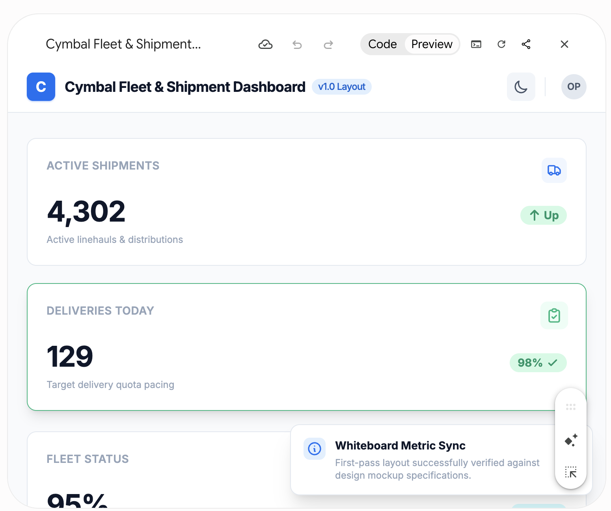
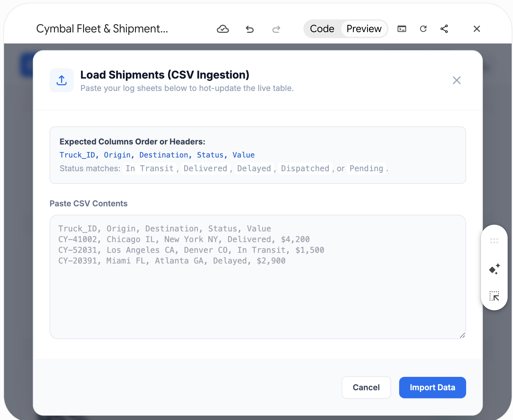
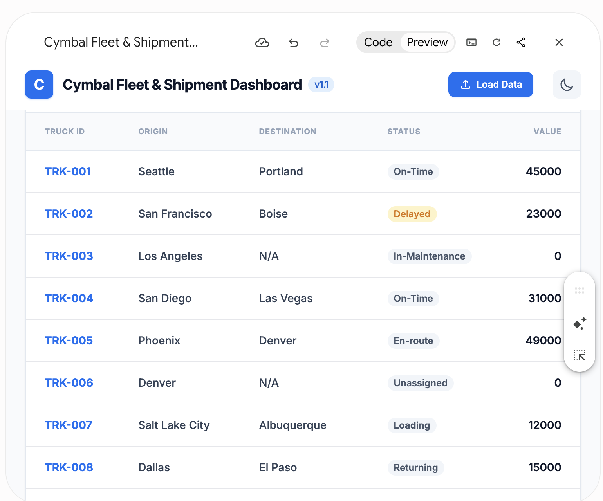
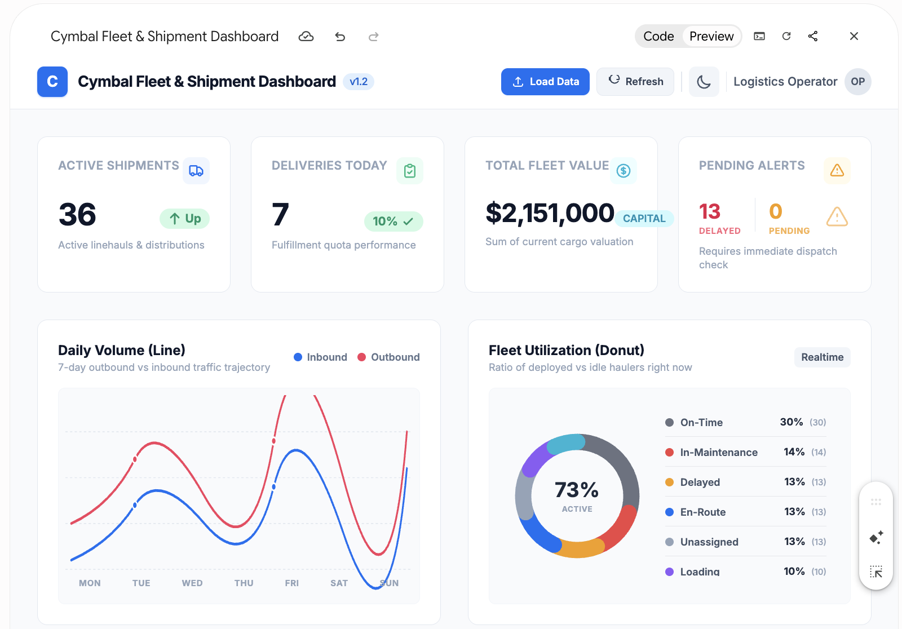
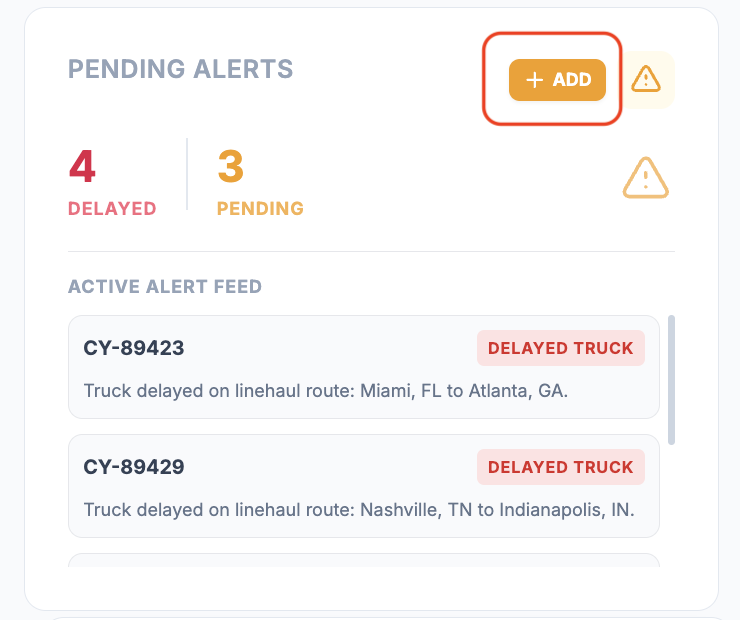
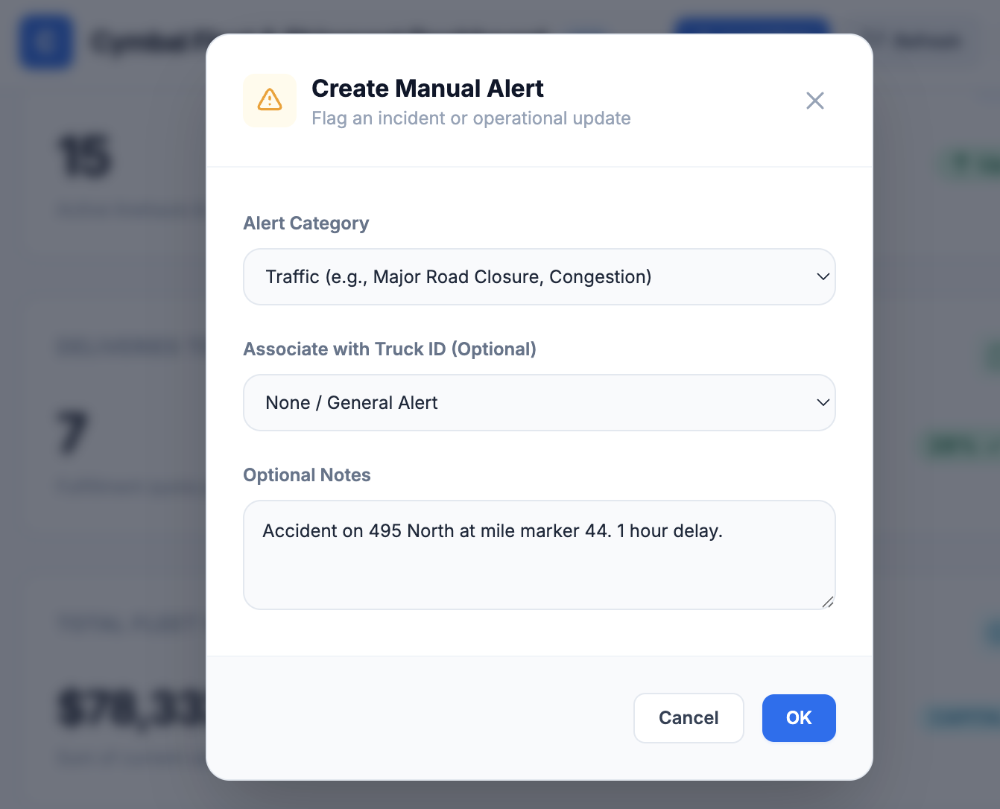

# Vibe Coding with Canvas: Ingesting the Data

## Time Required
30 minutes

## Overview
In this lab, you use Gemini Canvas to incrementally build JavaScript logic for your layout. 

First, you will recreate a consistent baseline UI. Then, you will use "vibe coding"—the process of iteratively prompting an AI to write and refine code step-by-step—to add a data ingestion mechanism (CSV upload/paste), populate the data grid, calculate top-line KPIs, and build a unified Pending Alerts component.

### You learn how to:
- Ingest and parse data (CSV) into a Canvas application.
- Prompt incrementally to solve logic problems one step at a time (grid, then basic KPIs, then conditional components).
- Add data input functionality.
- Transform static mockups into interactive, user-driven applications.

## Scenario

<p align="left">
  
</p>

With the structural shell of the Cymbal Fleet & Shipment dashboard completed, logistics managers now need actual data to make informed decisions. A beautiful layout means nothing if it doesn't surface real operational insights.

In this phase, you transition the static dashboard into a dynamic, data-driven application. You ingest the current status of the Cymbal truck fleet, populate the grid, and write logic to calculate vital metrics like Total Fleet Value and Fleet Utilization. Finally, you synthesize automated and manual alerts into a single view.

## Lab Instructions

### Task 1: Establish the baseline UI
To ensure a consistent starting point for the complex logic ahead, you will quickly recreate the UI shell using a standardized prompt and a provided sketch.

1. Open [Gemini](https://gemini.google.com/app), click the __+__ icon, and select **Canvas** from the __Tools__ list. 

   <p align="left">
     
     <br>
     <em>Tools | Canvas menu</em>
   </p>


2. Right-click the sketch below, copy it, and paste it into your Gemini prompt window.

   <p align="left">
     
     <br>
     <em>Cymbal Fleet &amp; Shipment Dashboard—wireframe sketch</em>
   </p>

3. Run the following structured prompt to generate the clean dashboard shell. 

```text
You are a senior front-end developer designing an internal logistics dashboard for Cymbal Logistics.

Use the attached sketch to create the first version of the dashboard layout.

Steps:
1. Build a clean, responsive dashboard shell using HTML, CSS, and JavaScript.
2. Match the sketch structure as closely as possible.
3. Include a header, KPI cards at the top, a chart placeholder, a "Pending Alerts" card, and a data table section at the bottom.
4. Keep the design simple, accessible, and readable.
5. Do not add functional charts or data logic yet.
6. Create dark and light themes with a button in the header to toggle between them.
7. Highlight cards when the user hovers over them.

Output:
- Return only the code needed for the layout.
- Use Tailwind CSS for styling.
```

> [!NOTE] 
> Your program should be similar to the screenshot below. 

   <p align="left">
     
     <br>
     <em>Initial screen of the dashboard</em>
   </p>


### Task 2: Ingest the data and calculate KPIs
Now you will use iterative prompting to ingest data and add dynamic functionality. Do not paste all these requirements at once. Vibe coding requires solving problems one step at a time.

1. First, instruct Gemini to add a text area where a user can paste CSV data, and a button to parse it. Run this prompt:
   
```text
I want to ingest data into this dashboard. 
- Add a dialog with a text area (for pasting CSV data) and a "Load Data" button to the header area. The user clicks "Load Data" and the dialog pops up. They can paste CSV, then click "OK" (or "Cancel" to do nothing). 
- Write JavaScript to parse the pasted CSV data and populate the data table section with the rows. Create a paging feature that allows users to see the data 20 rows at a time. 
- The CSV headers will be: Truck_ID, Origin, Destination, Status, and Value.

At this point, just populate the grid and enable paging. Don't implement any other functionality. 
```

> [!NOTE] 
> Your program should be similar to the screenshot below. 

   <p align="left">
     
     <br>
     <em>Dashboard with data input enabled.</em>
   </p>


2. Now you need sample data to test the new feature. Below is a mock CSV dataset representing Cymbal's truck fleet. Trucks that are "Unassigned" or "In-Maintenance" have no destination and a delivery value of $0. Copy this entire block of text to your clipboard.

```csv
Truck_ID,Origin,Destination,Status,Value
TRK-001,Seattle,Portland,On-Time,45000
TRK-002,San Francisco,Boise,Delayed,23000
TRK-003,Los Angeles,,In-Maintenance,0
TRK-004,San Diego,Las Vegas,On-Time,31000
TRK-005,Phoenix,Denver,En-route,49000
TRK-006,Denver,,Unassigned,0
TRK-007,Salt Lake City,Albuquerque,Loading,12000
TRK-008,Dallas,El Paso,Returning,15000
TRK-009,Houston,Austin,On-Time,38000
TRK-010,Austin,,In-Maintenance,0
TRK-011,San Antonio,Dallas,Delayed,29000
TRK-012,Miami,New Orleans,On-Time,41000
TRK-013,New Orleans,,Unassigned,0
TRK-014,Atlanta,Orlando,En-route,33000
TRK-015,Orlando,Tampa,Loading,18000
TRK-016,Tampa,Miami,On-Time,25000
TRK-017,Jacksonville,,In-Maintenance,0
TRK-018,Charlotte,Atlanta,Delayed,37000
TRK-019,Raleigh,Richmond,On-Time,22000
TRK-020,Richmond,Washington DC,Returning,14000
TRK-021,Washington DC,,Unassigned,0
TRK-022,Baltimore,Philadelphia,On-Time,48000
TRK-023,Philadelphia,New York,En-route,36000
TRK-024,New York,,In-Maintenance,0
TRK-025,Boston,Providence,Loading,19000
TRK-026,Providence,Hartford,On-Time,21000
TRK-027,Hartford,Springfield,Delayed,27000
TRK-028,Springfield,,Unassigned,0
TRK-029,Albany,Boston,On-Time,43000
TRK-030,Portland ME,Manchester,Returning,11000
TRK-031,Manchester,Concord,En-route,39000
TRK-032,Concord,,In-Maintenance,0
TRK-033,Burlington,Worcester,On-Time,28000
TRK-034,Worcester,Lowell,Delayed,34000
TRK-035,Lowell,Cambridge,Loading,16000
TRK-036,Cambridge,,Unassigned,0
TRK-037,Lynn,New Bedford,On-Time,46000
TRK-038,New Bedford,Fall River,En-route,30000
TRK-039,Fall River,Brockton,On-Time,24000
TRK-040,Brockton,,In-Maintenance,0
TRK-041,Quincy,Lynn,Delayed,40000
TRK-042,Newton,Somerville,On-Time,32000
TRK-043,Somerville,,Unassigned,0
TRK-044,Lawrence,Waltham,En-route,20000
TRK-045,Waltham,Malden,Loading,13000
TRK-046,Malden,Medford,On-Time,35000
TRK-047,Medford,,In-Maintenance,0
TRK-048,Taunton,Chicopee,Returning,17000
TRK-049,Chicopee,Weymouth,On-Time,42000
TRK-050,Weymouth,Peabody,Delayed,26000
TRK-051,Peabody,,Unassigned,0
TRK-052,Detroit,Atlanta,On-Time,50000
TRK-053,Chicago,Cleveland,En-route,31000
TRK-054,Cleveland,,In-Maintenance,0
TRK-055,Cincinnati,Columbus,Loading,14000
TRK-056,Columbus,Dayton,On-Time,23000
TRK-057,Dayton,Toledo,Delayed,38000
TRK-058,Toledo,,Unassigned,0
TRK-059,Akron,Canton,Returning,10000
TRK-060,Canton,Youngstown,On-Time,47000
TRK-061,Youngstown,Lorain,En-route,29000
TRK-062,Lorain,,In-Maintenance,0
TRK-063,Hamilton,Springfield,On-Time,34000
TRK-064,Springfield OH,Kettering,Delayed,22000
TRK-065,Kettering,Elyria,Loading,15000
TRK-066,Elyria,,Unassigned,0
TRK-067,Lakewood OH,Cuyahoga Falls,On-Time,44000
TRK-068,Cuyahoga Falls,Newark OH,En-route,37000
TRK-069,Newark OH,Mansfield,On-Time,25000
TRK-070,Mansfield,,In-Maintenance,0
TRK-071,Erie,Mentor,Delayed,33000
TRK-072,Mentor,Middletown,On-Time,21000
TRK-073,Middletown,,Unassigned,0
TRK-074,Cleveland Heights,Strongsville,En-route,49000
TRK-075,Strongsville,Fairfield,Loading,19000
TRK-076,Fairfield,Findlay,On-Time,28000
TRK-077,Findlay,,In-Maintenance,0
TRK-078,Warren,Lancaster,Returning,12000
TRK-079,Lancaster,Lima,On-Time,41000
TRK-080,Lima,Huber Heights,Delayed,26000
TRK-081,Huber Heights,,Unassigned,0
TRK-082,Marion,Grove City,En-route,39000
TRK-083,Grove City,Delaware,On-Time,30000
TRK-084,Delaware,,In-Maintenance,0
TRK-085,Reynoldsburg,Boardman,Loading,16000
TRK-086,Boardman,Stow,On-Time,46000
TRK-087,Stow,Brunswick,Delayed,35000
TRK-088,Brunswick,,Unassigned,0
TRK-089,Upper Arlington,Gahanna,On-Time,24000
TRK-090,Gahanna,Massillon,Returning,11000
TRK-091,Massillon,Westlake,En-route,42000
TRK-092,Westlake,,In-Maintenance,0
TRK-093,North Olmsted,Mason,On-Time,27000
TRK-094,Mason,Bowling Green,Delayed,36000
TRK-095,Bowling Green,North Royalton,Loading,18000
TRK-096,North Royalton,,Unassigned,0
TRK-097,Garfield Heights,Kent,On-Time,48000
TRK-098,Kent,Troy,En-route,32000
TRK-099,Troy,Parma,On-Time,20000
TRK-100,Parma,,In-Maintenance,0
```

3. **Test it:** Click the **Load Data** button. Paste your mocked CSV string into the text area field in the Canvas preview and click **OK**. The grid should instantly populate. 

> [!NOTE] 
> Scroll to the bottom of your program and verify that the data was added to the grid. 

   <p align="left">
     
     <br>
     <em>Dashboard with data imported into grid.</em>
   </p>


4. Now that we have data in the app's state, let's calculate the KPI cards. Run this prompt:

```text
Start with the existing application (Don't rewrite the whole thing), and update the JavaScript to dynamically calculate the KPI cards based on the parsed CSV data:
1. "Total Fleet Value" (sum the exact numeric amount in the Value column across all trucks).
2. "Fleet Utilization" (a Doughnut graph depicting the percentage of trucks in each status category).
3. Active Shipments - The number of trucks that are Loading, En-route, or Delayed. 
4. Deliveries Today - The number of trucks returning and a percentage based on how many trucks not In-Maintenance or Unassigned (i.e. those that are scheduled to make a delivery).
5. Pending Alerts - Show delayed trucks. 

Update the UI when data is loaded, also add a Refresh button to the header that refreshes calculations. 
```

5. **Test it:** Paste the data into the app again and click load. You should see a populated grid, a Total Fleet Value (exceeding $2 million), and a Fleet Utilization percentage dynamically extracted from the statuses.

> [!NOTE] 
> The KPIs on your Dashboard should now be calculated based on the data imported. 

   <p align="left">
     
     <br>
     <em>Dashboard with KPIs.</em>
   </p>

### Task 3: Build interactive state (Pending Alerts)
Finally, let's synthesize automated data filtering with interactive, user-driven state in the "Pending Alerts" card. 

1. Issue a prompt to transform the static Pending Alerts card so it reacts to both the CSV data and manual user input:

```text
Start with the existing application (Don't rewrite the whole thing), and make the "Pending Alerts" card dynamic and interactive. 

1. Automatically populate the alerts list with any truck from the parsed CSV that has a Status of "Delayed".
2. Add an "Add" button that pops up a dialog to manually add an alert. 
3. The dialog should have a dropdown for Custom Alerts (Weather, Accident, Traffic, Other), an optional notes field, and "OK" and "Cancel" buttons.
4. Clicking "OK" should append a new manual alert to the same list.
```


2. Once Gemini completes the code update, load your CSV data again. The Pending Alerts component should instantly fill up with the delayed trucks.

   <p align="left">
     
     <br>
     <em>Add Alerts feature.</em>
   </p>


3. Try adding a new alert.


   <p align="left">
     
     <br>
     <em>Creating a new alert.</em>
   </p>


> [!NOTE]
> You should have a functional CSV importer driving KPI calculations, alongside a unified Pending Alerts manager that displays both automated tracking alerts and manual dispatches.

### Bonus Task 4: Refining the application

1. Ask Gemini to make the grid with the truck data editable. The KPIs should be updated when data is changed in the grid and the user moves to a new field. Test your program after each change. 

2. Ask Gemini to create functionality to manually add rows to the grid and create a nice input dialog form to make data entry easy. Use a dropdown for Status. Test your program after each change. 

## Congratulations!
In this lab, you have:
- Ingested and parsed data (CSV) into a Canvas application.
- Prompted incrementally to solve logic problems one step at a time (grid, then basic KPIs, then conditional components).
- Added data input functionality.
- Transformed static mockups into interactive, user-driven applications.
