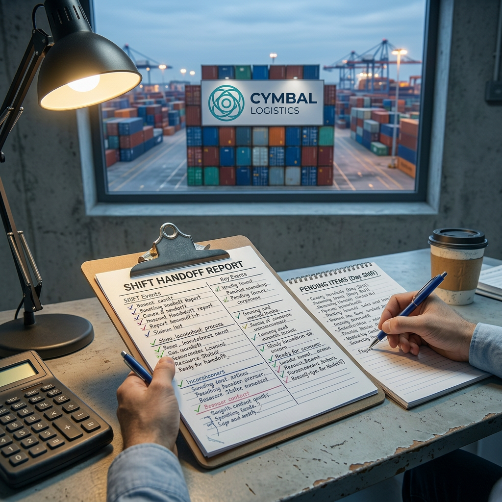
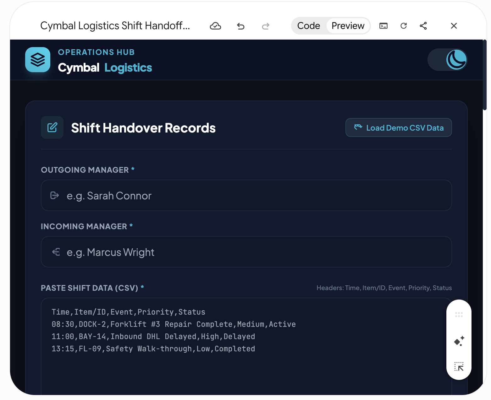
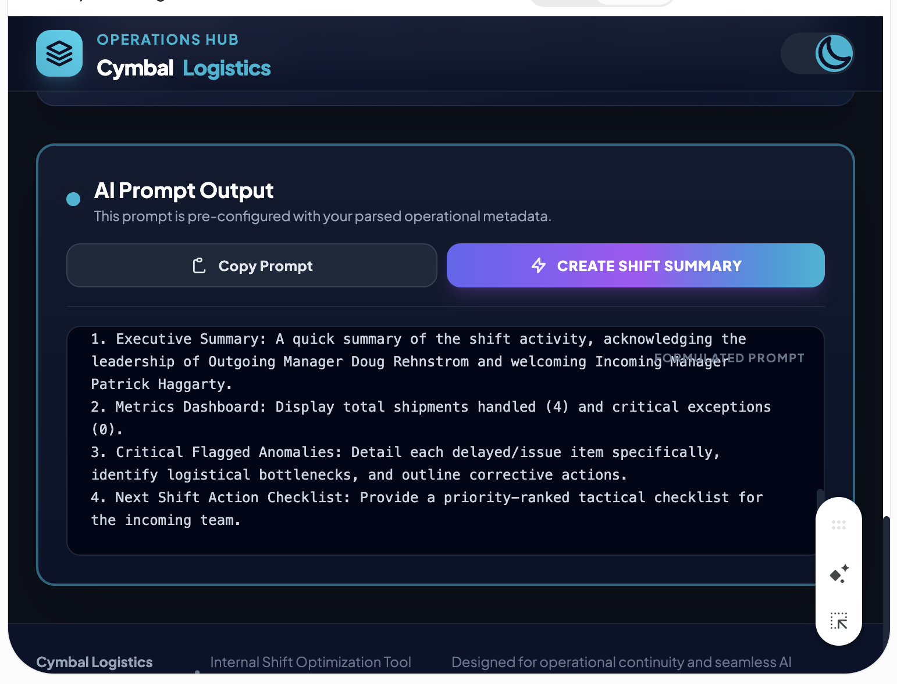
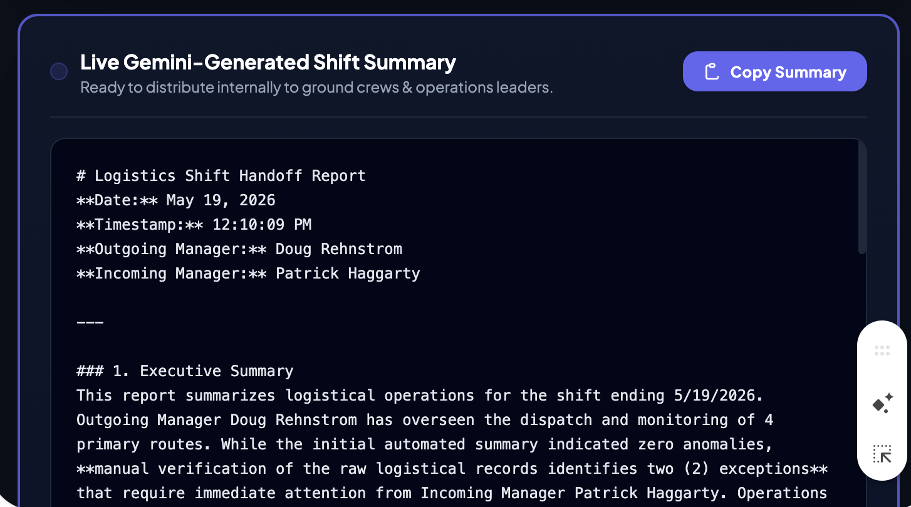
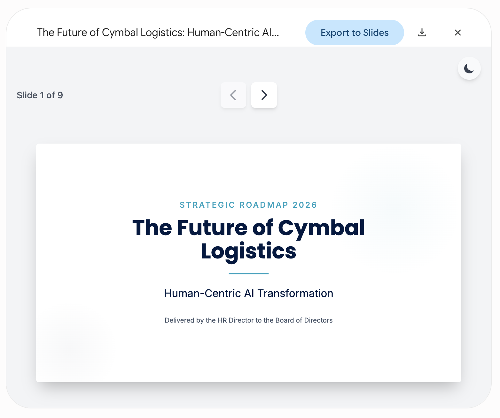

# Unlocking Canvas Magic: Live AI Integration and Executive Presentations

## Time Required
30 minutes

## Overview
In this lab, you use Gemini Canvas to build two real-world applications that go beyond static UI. First, you will vibe code a Shift Handoff Tool that integrates live Gemini AI to automatically generate professional shift summaries from raw operational data. Then, you will use Canvas as a presentation engine to produce a polished executive slide deck in minutes.

### You learn how to:
- Integrate live Gemini API calls directly into a Canvas web application.
- Build structured, data-driven AI prompts programmatically from user input.
- Use Canvas to generate an interactive slide presentation.
- Export a Canvas presentation to Google Slides or download it as a PDF.

## Scenario

<p align="left">
  
</p>

Cymbal Logistics continues its AI-first transformation. In this lab, you build two tools that put generative AI directly in the hands of operations staff: a Shift Handoff Tool that writes professional summaries from raw shift data, and an executive presentation that communicates the company's workforce strategy to the Board of Directors.

## Lab Instructions

### Task 1: Integrating generative AI into Canvas tools

#### Scenario
Cymbal Logistics shift managers currently write handoff reports by hand—a slow and inconsistent process that creates communication gaps between shifts. The operations team wants a simple internal tool where an outgoing manager can paste shift data and notes, and instantly receive a clean, structured summary ready to hand off to the incoming manager.

1. Open [Gemini](https://gemini.google.com/app), click the __+__ icon, and select **Canvas** from the __Tools__ list. 

   <p align="left">
     
     <br>
     <em>Tools | Canvas menu</em>
   </p>

2. Run the following prompt to create the initial UI of the application. 

```text
In Canvas, create a single-file HTML/CSS/JS web app called 'Cymbal Logistics: Shift Handoff tool'. 

The UI should have:
- Input fields include: 
    - 'Outgoing Manager' and 'Incoming Manager' text boxes.
    - A large text area labeled 'Paste Shift Data (CSV)'.
    - A smaller text area for 'Additional Shift Notes'.
- Add a prominent button that says 'Format AI Prompt'.
- A read-only text area below the bottom labeled 'AI Prompt Output' (hidden until the button is clicked).
- Use a modern theme that toggles between light and dark modes. Use a color scheme with deep blues and bright teal accents.
```

> [!NOTE]
> You should get something similar to the screenshot below. 

   <p align="left">
     
     <br>
     <em>Cymbal Logistics Shift Handoff Tool—initial UI</em>
   </p>

3. Enter the following prompt to add the logic to the application. 

```text
Update the JavaScript logic for the 'Format AI Handoff' button. When clicked, it should:

- Parse the CSV data to identify how many total shipments there were, and specifically extract any rows where the 'Status' is 'Delayed' or 'Issue'.
- Combine the Manager names, the parsed CSV insights, and the Additional Notes into a well-structured prompt designed for an AI.
- The generated prompt should start with: 'Act as an expert Logistics Shift Supervisor. Create a professional shift handoff report using the following data...'
- Display this generated prompt in the bottom read-only text area.

Once the AI Prompt has been generated, enable another button "Create Shift Summary". This button should use Gemini to run the generated prompt and display the summary in a read-only text area. Add a Copy button, so the user can copy the result to their clipboard.
```

4. Let's test the app so far. Enter the following values:

  - Outgoing Manager: Your name
  - Incoming Manager: A friend's name
  - Paste Shift Data (CSV):
```text
Truck_ID,Route,Driver,Status,Notes
TRK-101,NY to BOS,Smith,On-Time,Standard delivery
TRK-102,NJ to PHI,Jones,Delayed,Traffic on I-95
TRK-103,NY to DC,Lee,On-Time,None
TRK-104,PA to NY,Davis,Issue,Tire pressure warning, needs maintenance check
```

  - Additional Shift Notes:
```text
Warehouse bay 4 has a broken docking plate, maintenance is coming tomorrow at 9 AM. Make sure all morning reefers are routed to bays 1-3.

Jeff Smith called in sick, John Miller will cover for him. 
```

5. Click the **Format AI Prompt button**. This creates a structured prompt optimized for this use case. It should look similar to the screenshot below. 

   <p align="left">
     
     <br>
     <em>The generated AI prompt built from shift data and manager notes</em>
   </p>

6. Click the **Create Shift Summary** button to generate the shift summary. This runs the prompt using the Gemini API. The output should be similar to the following. 

   <p align="left">
     
     <br>
     <em>AI-generated professional shift handoff summary</em>
   </p>

7. Test your app. If anything doesn't work as expected, ask Gemini to fix it. Ask Gemini to fix any features you don't like. 


### Task 2: Using Canvas to generate presentations

#### Scenario
Cymbal Logistics is undergoing a significant AI-first transformation. The HR Director needs to present the workforce strategy—covering automation, upskilling, and new recruiting profiles—to the Board of Directors. Rather than spending hours building a slide deck from scratch, she will use Gemini Canvas to generate a polished, executive-level presentation in minutes.

1. In Gemini, create a new chat, click the __+__ icon, and select **Canvas** from the __Tools__ list.

2. Run the following prompt to create a slides presentation. 

```text
Persona: Act as the HR Director for Cymbal Logistics. I need to deliver a 15-minute presentation to the Board of Directors regarding our AI Transformation strategy. 

Context: Cymbal Logistics is a legacy global shipping and supply chain enterprise currently undergoing a massive digital overhaul. We operate a fleet of 1,200 heavy-duty trucks and manage 4.5 million square feet of warehouse space across North America and Europe. Traditionally, our operations have relied on manual entry for shipment tracking, phone-based dispatching, and paper-heavy "Shift Handoff" reports. We are currently transitioning to an "AI-First" infrastructure, deploying internal tools on Google Cloud that automate data parsing and provide real-time route optimization. This transition is creating significant anxiety among our 3,000-person workforce regarding job security and the technical skills required to operate in this new environment. The Board is particularly interested in how we will balance rapid automation with our commitment to "Human-Centric" logistics.

Task: Create a modern, high-tech, interactive slide presentation in Canvas. 

**Design Requirements:**
- Use a professional "Logistics-Tech" aesthetic: Light background (White with Deep Slate and Navy accents to match the Cymbal brand.)

**Presentation Content:**
The deck should include 8 slides covering:
1. **Title Slide:** The Future of Cymbal Logistics: Human-Centric AI Transformation.
2. **The Impact of AI:** A high-level view of how AI is modernizing our fleet and back-office operations.
3. **Short-Term Staffing:** Moving from manual data entry to "AI-Augmented" roles.
4. **Long-Term Staffing:** Predicted shift in core competencies over the next 3-5 years.
5. **The Upskilling Initiative:** Our plan to transition current employees into "Vibe Coding" and AI-management roles.
6. **Recruiting for the Future:** Identifying and attracting new talent profiles (Data Science, Machine Learning, and AI Orchestration).
7. **Closing/Call to Action:** Strategic investment requirements for the HR roadmap.
8. Q&A

Ensure the text is executive-level, concise, and professional.
```

> [!NOTE]
> Your output should be similar to the following. 

   <p align="left">
     
     <br>
     <em>Executive presentation generated by Gemini Canvas</em>
   </p>

3. Experiment with the __Export to Slides__ and the __Download__ functionality. If you export your presentation to Google Slides the AI-generated content will be easily editable. If you are 100% satisfied with the generated output, you can download it as a PDF. 

### Bonus Task 3: Experiment with Gemini Pro Models and your own use case

1. By default, Gemini will use the faster Flash model. If you have time, rerun the two lab examples using the Pro model. Use the model selector in the __Ask Gemini__ text box to select the model. 

2. Think of a useful program you would like to vibe code. First, prompt Gemini to build the UI. You can do this either by describing what you want or draw a mockup and upload it to Gemini. Then, prompt Gemini to add the logic behind your application. 

3. Describe a slide presentation for a meeting you might have in your own work. Use the prompt above as a template. 


## Congratulations!
In this lab, you have:
- Integrated live Gemini API calls directly into a Canvas web application.
- Built structured, data-driven AI prompts programmatically from user input.
- Used Canvas to generate an interactive slide presentation.
- Exported a Canvas presentation to Google Slides and downloaded it as a PDF.
