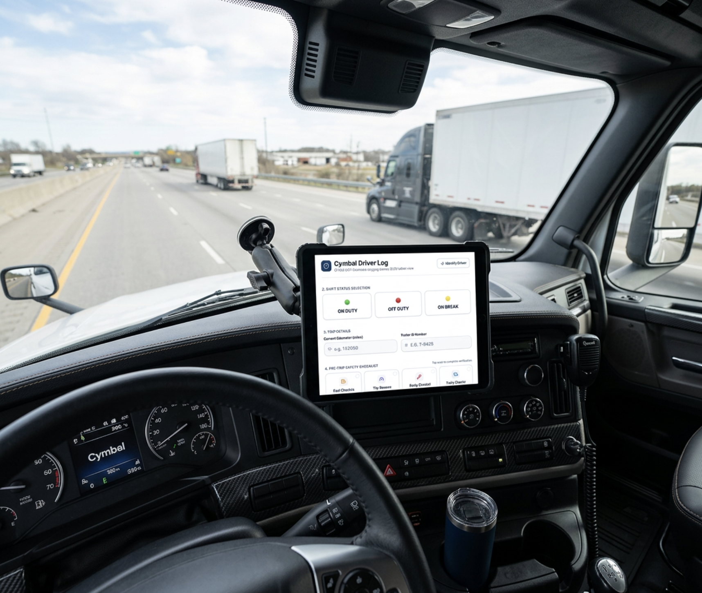
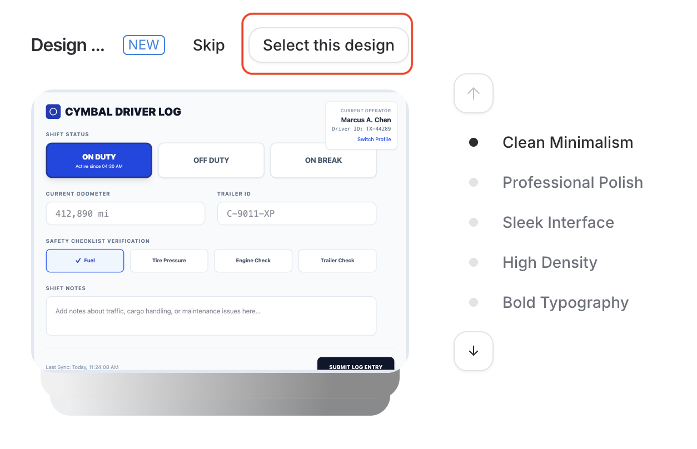
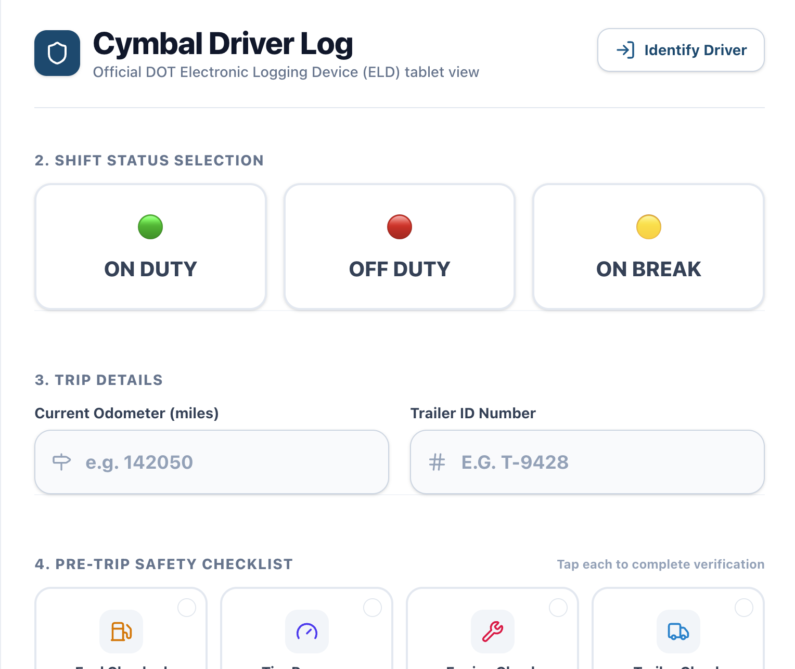
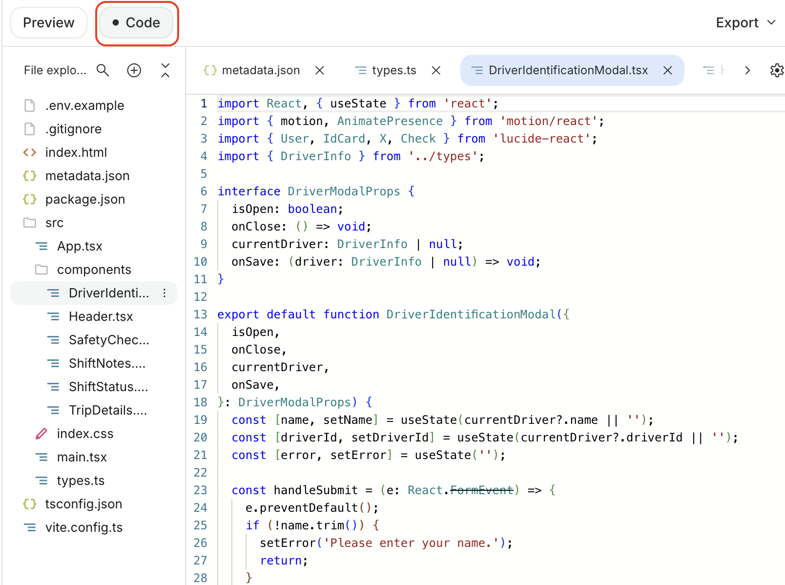
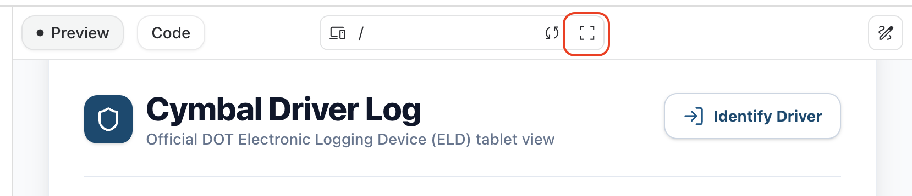
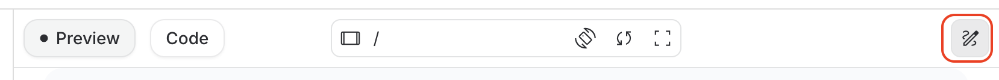
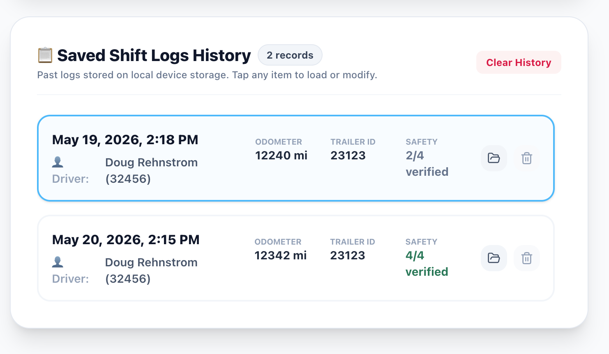

# Vibe Coding in Google AI Studio

## Time Required
30 minutes

## Overview
In this lab, you use Google AI Studio to vibe code a tablet-friendly driver log application for Cymbal Logistics. Unlike the Canvas-based approach in previous labs, AI Studio generates a proper multi-file React application using TypeScript, Tailwind CSS, and an organized folder structure. You will iteratively build the app by prompting AI Studio to add features one step at a time.

### You learn how to:
- Use Google AI Studio to build a multi-file React application.
- Compare AI Studio's structured code output with Canvas's single-file approach.
- Add state persistence to a web app using browser `localStorage`.
- Extend an existing application with new features through conversational prompting.
- Export application data as CSV.

## Scenario

<p align="left">
  
</p>

Cymbal Logistics is modernizing how its drivers record shift activity in the field. Currently, drivers fill out paper log sheets at the start and end of each shift—a slow, error-prone process that makes fleet-wide activity difficult to track.

This application will give drivers a simple, tablet-friendly digital log where they can record their shift status, odometer readings, trailer assignments, safety checklist confirmations, and shift notes—all stored locally on their device and easily exported for review.

## Lab Instructions

### Task 1: Create the Driver Log app
Google AI Studio's app builder generates a complete, multi-file React application from a natural language prompt—a significant step up from a single HTML file. In this task, you create the initial driver log UI and then add state persistence so the app retains data between sessions.

1. Open [Google AI Studio](https://aistudio.google.com/apps) and log in. If a video appears, click __Skip__.

2. Select the __Build__ menu on the left and then run the following prompt which describes your app. 

> [!NOTE] 
> Carefully read the prompt before pasting it into the chat. 

```text
Create a simple React application using Tailwind CSS called "Cymbal Driver Log". 
This is a basic tablet interface for a truck driver to log their shift details.

CRITICAL INSTRUCTION: Keep the UI extremely simple. Do not add mock data simulators, charts, side navigation bars, or any features not explicitly requested below. Build ONLY a static layout.

UI Requirements:
- Use a stacked layout centered on the screen optimized for a tablet. Make it responsive to different screen sizes and support Portrait and Landscape modes. 
- Theme: Light background with dark blue and slate accents. 
- Ensure all inputs and buttons are large and easy to tap.

Include EXACTLY these six sections, stacked vertically:
1. Header: A simple title that says "Cymbal Driver Log".
2. Shift Status: A row of three large, distinct buttons: "ON DUTY", "OFF DUTY", and "ON BREAK".
3. Trip Details: Two large input fields for "Current Odometer" and "Trailer ID".
4. Add a row of four buttons that verify they performed their safety checklist (Fuel, Tire pressure, Engine Check, and Trailer Check)
5. Shift Notes: A single large text area for adding notes.
6. Add a Login link that simply asks the driver for their name and driver ID. (This is not a username and password, they are just identifying themselves.) Display this in the upper right corner. 

Stop here. Just build the visual layout.
```

> [!WARNING] 
> It will take a little while for your app to be generated. 

3. At one point, while the app is being built, you will be prompted to select a theme. Examine the choices and pick the one you like the best. 

   <p align="left">
     
     <br>
     <em>Select your preferred theme.</em>
   </p>

> [!NOTE] 
> Your output should be similar to the following. 

   <p align="left">
     
     <br>
     <em>Cymbal Driver Log—initial UI</em>
   </p>

4. Click the __Code__ button at the top. Notice, this app is not being coded in a single file like in Gemini using Canvas. This program uses a proper structure for a ReactJS app using TypeScript files, CSS, and an organized folder structure. 

   <p align="left">
     
     <br>
     <em>Code view showing the React project structure</em>
   </p>

5. Go back to __Preview__ and then click the __Fullscreen__ icon and explore the app. Try to make sense of the various features. 

   <p align="left">
     
     <br>
     <em>Fullscreen preview of the Cymbal Driver Log</em>
   </p>

6. Select the __Device__ button and choose __Tablet__. 

7. Exit fullscreen and click the __Edit tool__ icon. 

   <p align="left">
     
     <br>
     <em>The Edit tool, used to continue prompting</em>
   </p>


8. Enter the following prompt in the chat and run it. 

```text
Now, let's make the app store shift history. 
- Ensure that all inputs: Current Date and Time, Driver Name, Driver ID, Odometer, Trailer ID, Safety Checklist, and Shift notes are saved to 'localStorage'.
- When I refresh the page, the app should remember exactly what I entered and which status button was active.
- Add an "Add New Shift" button at the bottom that resets the form for a new day (shift). 
- Keep the history in Local storage, so the user can pull up past shifts. 
```

9. Test your app when the prompt completes. Click the __Fullscreen__ icon. Identify yourself. Then, complete the form (just make up the data), and save it. 

10. Try adding a couple shifts. You should see a logs history. It should look similar to what is shown below. 

   <p align="left">
     
     <br>
     <em>Driver Log showing saved shift history</em>
   </p>

11. If you find bugs or want changes to be made, ask AI Studio to make them. Make sure you test after each change. Make targeted changes one at a time. 

### Task 2: Add features to the Driver Log app
With the core driver log working, you will now extend the app with two new capabilities: a shift history export that lets drivers copy their records as CSV, and a dedicated expense logging tab.

1. Ask AI Studio to add an "Export History". It should retrieve all the data from local storage, format it as CSV, and pop up a window where the user can copy it to their clipboard. 

2. Make sure you save some shift data and test the export feature. 

3. Ask AI Studio to create a new tab in the application that allows the driver to log expenses. You can do this any way you like. It should be easy to add receipts and expense information. They should also be able to export the expenses and easily be able to add them to an email or spreadsheet to be submitted. 

### Bonus Task 3: Try your own use case

1. Think of a simple app you might like for your work or personal use. First create a short, 1 or 2-sentence description of the app. Then, add a bulleted list of features. Try creating it in Google AI Studio.

### Bonus Task 4: Try sharing and deploying your app

1. Click the __Share__ button at the top-right to share your app with a friend. Send them the link and tell them to try it out. 


2. You can try deploying your app. Click the __Publish__ button and follow the instructions. This requires a Google Cloud account and project. The app is published to Google Cloud Run, a production-quality environment for running web applications. 


## Congratulations!
In this lab, you have:
- Used Google AI Studio to build a multi-file React application through vibe coding.
- Compared AI Studio's structured code output with Canvas's single-file approach.
- Added `localStorage` state persistence to a running web app.
- Extended an application with new features through conversational prompting.
- Exported structured application data as CSV.
